# Level 1: Math You Can See
*A Simple Way to Finally Understand Math Through Shapes*

## Hook Intro: Why School Mathematics Fails You
Imagine sitting in a classroom, staring at a blackboard full of abstract letters. You are told to memorize rules, move variables around, and cross out numbers. School treats math like a rigid code you must obey.

But what if you could see the math instead? In this book, we translate abstract math into visual shapes. You won't memorize formulas. You will visualize blocks snapping together and structures stretching. Math makes perfect sense when you watch it happen.

---

## How to Use This Book
Treat this book like a **mental sandbox**. 
Read the scenario at the start of each idea. Close your eyes and visualize the shape. Check the image description to anchor your imagination. Read the "Aha Moment" to lock the concept into memory. Discover the practical steps and the pure geometry governing each rule.

---

# PART 1: CORE KNOWLEDGE

## Chapter 1: The Flow of Numbers (Basic Intuition)

### Addition ($+$)
**Imagine two small pools of water merging on a flat surface.**
Addition is the act of bringing pieces together. The water combines into a single, deeper pool.

[IMAGE_PROMPT: Two streams of blue water merging into a single larger puddle. Flat vector style, white background.]
> [!NOTE]
> **💡 AHA MOMENT:** Positive numbers add size without creating conflict.

**What it is:**
Addition calculates the total amount of two separate groups.

**How to solve:**
Line up the numbers vertically by place value. Add the columns from right to left. If a column totals more than 9, carry the extra 1 over to the next column.

**Why it works in space:**
When you add positive numbers, you extend a straight line in one direction. The shape grows longer.

**Summary:**
Addition adds pieces into the exact same space to build a larger shape.

### Subtraction ($-$)
**Imagine rowing a boat upstream and hitting a fast river current.**
A minus sign fights your progress. You move forward, but the current pushes you backward.

[IMAGE_PROMPT: A yellow boat pushing forward, while a red water current pushes it backward. Flat vector style, white background.]
> [!NOTE]
> **💡 AHA MOMENT:** A minus sign pushes backward against your forward movement.

**What it is:**
Subtraction calculates the difference between two numbers. It determines what remains after pieces are removed.

**How to solve:**
Line the numbers up vertically. Subtract the bottom digit from the top. If the top digit is smaller, borrow 1 from the next column before subtracting.

**Why it works in space:**
Subtraction shrinks the original shape. When you apply a minus, the shape slides backward along the grid, making it shorter.

**Summary:**
Subtracting measures opposing numbers. You calculate if your forward movement is bigger than the backward push.

### Negative Numbers (Standalone)
**Imagine a flat landscape. Positive numbers build towers upwards. Negative numbers dig holes downward.**
A negative number represents debt or depth.

[IMAGE_PROMPT: A flat ground line with a red hole dug into the earth, placed directly next to a blue rising tower. Minimalistic vector style, white background.]
> [!NOTE]
> **💡 AHA MOMENT:** Negative numbers extend the world downward below zero.

**What it is:**
A negative number is any value less than zero. It is the exact opposite of a positive amount.

**How to solve:**
To subtract a negative number, like $5 - (-3)$, change the double minus into a plus. The equation becomes $5 + 3 = 8$.

**Why it works in space:**
Removing a deep hole is the exact geometric equivalent of filling it with dirt. The double negative flips a downward hole into an upward block.

**Summary:**
Removing a hole means filling it. Two negatives flip to form a positive block.

### Absolute Value ($|-5|$)
**Imagine driving a car. Driving five miles forward consumes fuel. Driving five miles in reverse consumes the same fuel.**
Absolute value ignores whether you traveled forward or backward. It focuses exclusively on the total distance.
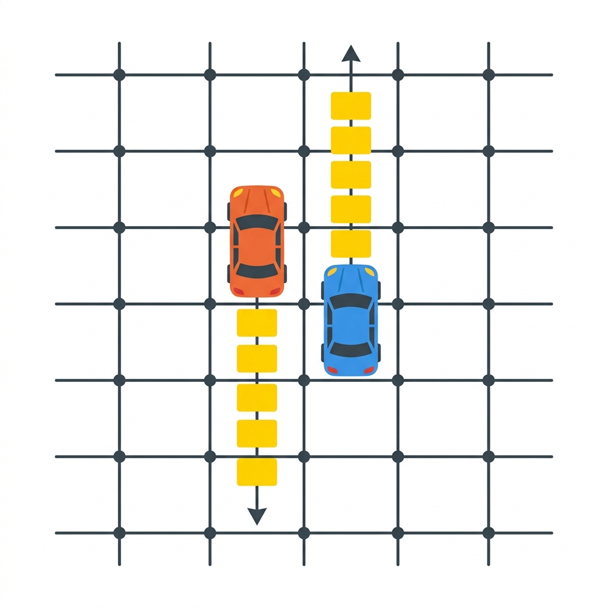
[IMAGE_PROMPT: Two cars parked side by side facing opposite directions. Both leave a yellow trail exactly 5 blocks long. Flat vector style, white background.]
> [!NOTE]
> **💡 AHA MOMENT:** Absolute value is the total distance traveled, ignoring direction entirely.

**What it is:**
Absolute value calculates the strict distance a number sits from zero.

**How to solve:**
Look at the number inside the parallel bars $|-5|$. Remove the negative sign. The result is always positive or zero. $|-5|$ becomes 5.

**Why it works in space:**
The parallel bars act as a geometric filter. They remove direction from the grid and force the object to report its total size.

**Summary:**
Absolute value removes minus signs and reports the raw size of the number.

---

## Chapter 2: Weaving Surfaces (Multiplication & Division)

### Multiplying Variables ($x \cdot x$)
**Imagine weaving horizontal blue threads crosswise with vertical red threads.**
When you multiply a variable by another variable, you weave them together. You take lines and lock them into a flat 2D surface ($x^2$).
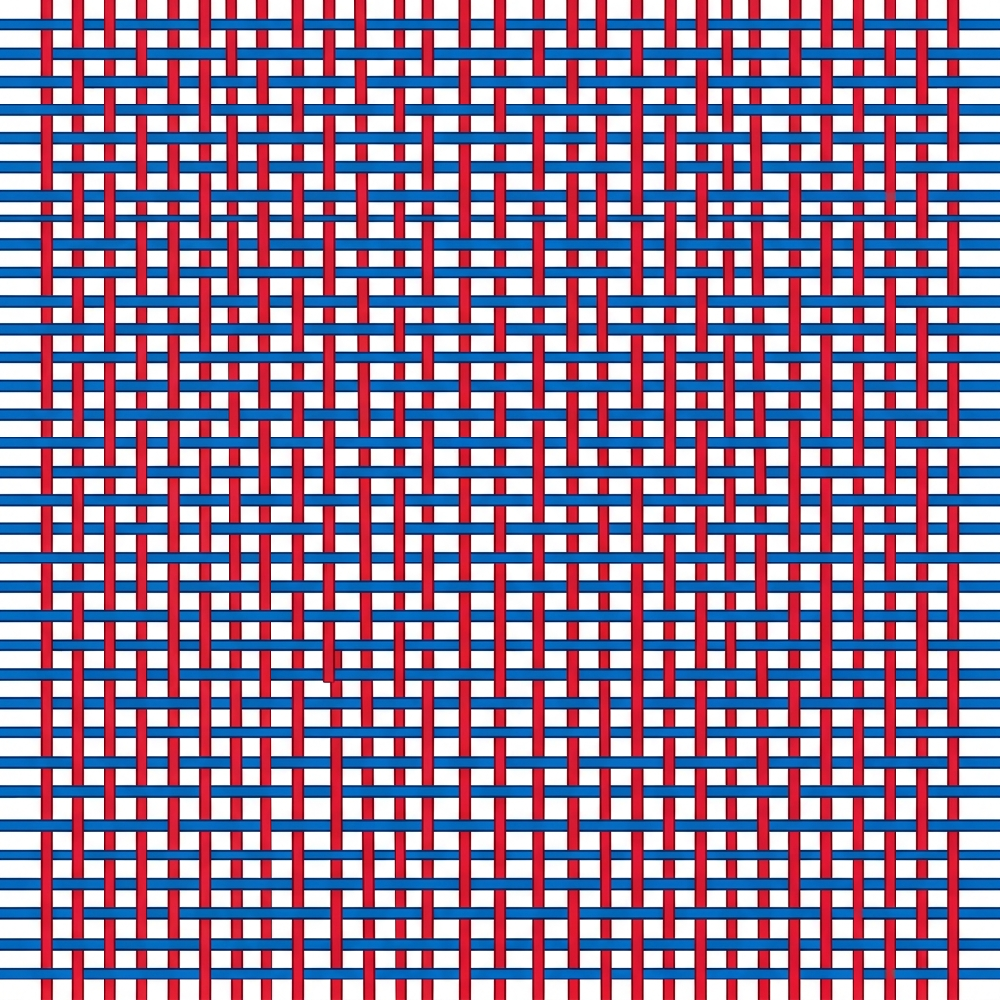
[IMAGE_PROMPT: Horizontal blue strings and vertical red strings locking tightly crosswise to create a flat 2D square. Flat vector style, white background.]
> [!NOTE]
> **💡 AHA MOMENT:** Multiplying variables weaves lines into solid flat shapes.

**What it is:**
Multiplying letters builds a new term with a higher exponent.

**How to solve:**
Count the number of identical letters being multiplied. Write that number as a small exponent at the top right. For $x \cdot x$, write $x^2$.

**Why it works in space:**
A single $x$ is a flat line. Mutiplying it by another $x$ stretches that line sideways to make a square. Multiplying a third time stretches the square upward to form a 3D box.

**Summary:**
Multiplying variables creates shapes. Variables like $x^2$ act as physical objects, not abstract letters.

### Multiplying by Numbers ($5 \cdot x$)
**Imagine turning the volume dial on a speaker.**
Standard numbers act as amplifiers. Multiplying a glowing wire by 5 makes it glow 5 times brighter. The shape of the wire stays identical.

[IMAGE_PROMPT: A single straight line glowing intensely next to an analog volume dial. Minimalistic vector style, white background.]
> [!NOTE]
> **💡 AHA MOMENT:** Numbers act as amplifiers, scaling the amount without altering the shape.

**What it is:**
Multiplying a variable by a raw number increases the quantity of that item.

**How to solve:**
When you add $2x + 3x$, you add the numbers together to get $5x$. You never change the exponent.

**Why it works in space:**
You are placing five individual wires side-by-side ($5x$). Because they never cross, they cannot weave into a square. The shape stays flat.

**Summary:**
Multiplying by a number ($5x$) scales the amount, while multiplying the variables ($x^2$) builds a completely new shape.

### Division ($\div$)
**Imagine breaking a large chocolate bar into equal smaller squares.**
The top number is the total size. The bottom number is how many pieces you must break it into.
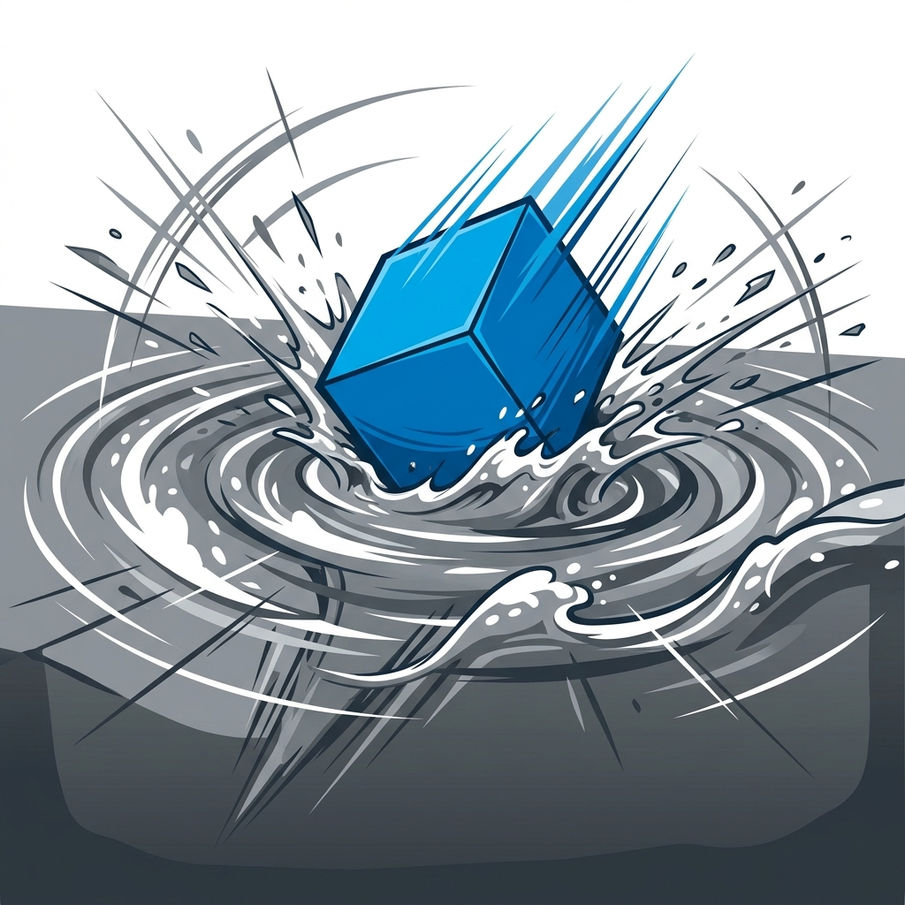
[IMAGE_PROMPT: A large blue square actively splitting cleanly into four identical smaller squares. Flat vector style, white background.]
> [!NOTE]
> **💡 AHA MOMENT:** Division separates a total amount into identical pieces.

**What it is:**
Division splits a total amount into equal groups to see how much goes into each piece.

**How to solve:**
To solve $20 \div 4$, ask yourself what number multiplied by 4 equals 20. The answer is 5.

**Why it works in space:**
Division breaks a large block into a grid of smaller exact squares. The starting shape is cut into equal pieces.

**Summary:**
Division cracks a big shape perfectly into smaller, identical pieces.

---

## Chapter 3: Mastering the Dimensions (Exponents & Roots)

### Exponents ($x^2, x^3$)
**Imagine a thin wooden rod inflating sideways to become a solid flat table.**
Squaring an object ($x^2$) pulls a 1D line into a 2D plane. Cubing it ($x^3$) raises that plane vertically into a 3D box.
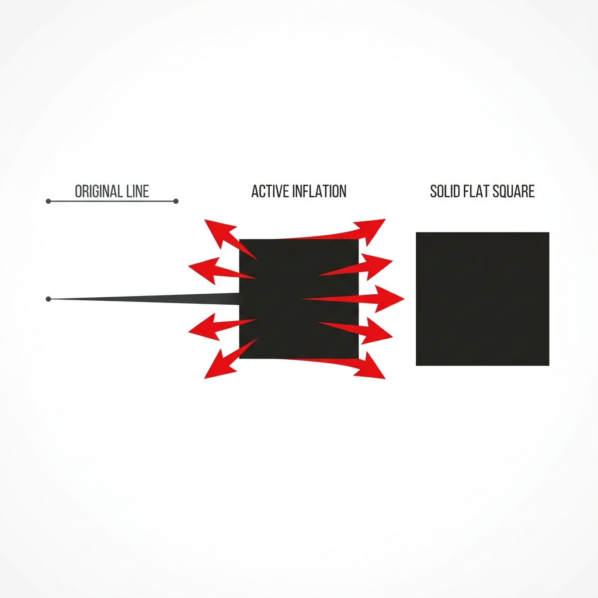
[IMAGE_PROMPT: A thin line inflating outward horizontally to form a solid flat square. Minimalistic vector style, white background.]
> [!NOTE]
> **💡 AHA MOMENT:** Exponents scale objects upward into entirely new dimensions of space.

**What it is:**
An exponent tells you how many times to multiply the base number by itself.

**How to solve:**
To solve $4^3$, you multiply $4 \times 4 \times 4$. The first pair equals 16. Then multiply $16 \times 4$ to get 64.

**Why it works in space:**
Exponents stretch shapes. You drag a line into a square, and pull that square upwards into a box.

**Summary:**
Exponents stretch shapes from lines, to squares, to boxes.

### Square Roots ($\sqrt{x}$)
**Imagine an industrial press flattening a solid box back down to the floor.**
Roots reverse shape expansion. A square root compresses a 2D square firmly back down into a 1D line.
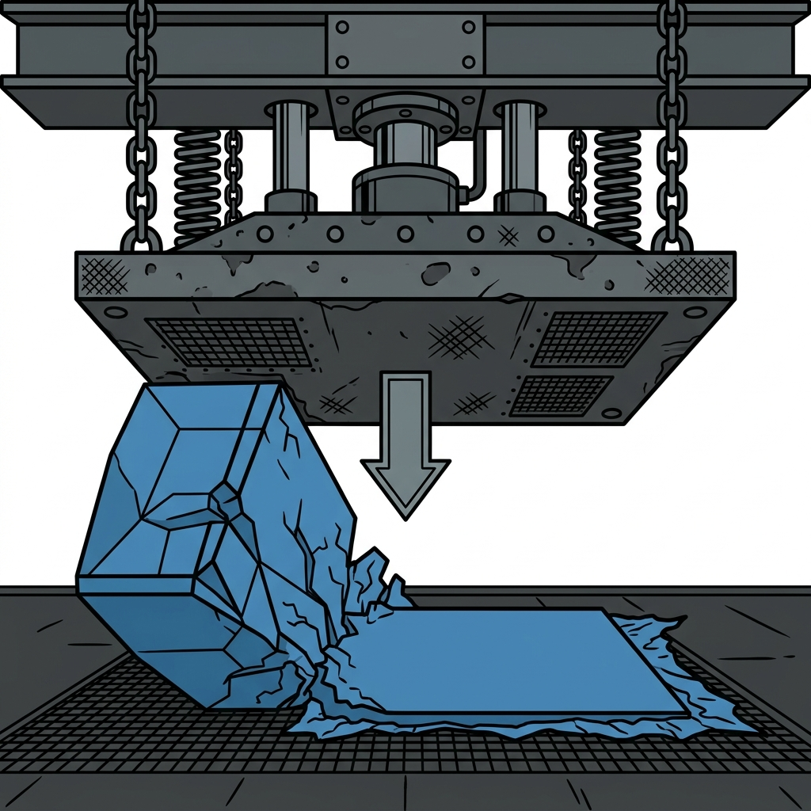
[IMAGE_PROMPT: A heavy iron plate crushing a 2D square strictly down into a 1D straight line. Flat industrial vector style, white background.]
> [!NOTE]
> **💡 AHA MOMENT:** Roots compress shapes down into lower dimensions.

**What it is:**
A square root asks what original base number was multiplied by itself to produce the current value.

**How to solve:**
To find $\sqrt{25}$, find the number that equals 25 when multiplied by itself. Because $5 \times 5 = 25$, the answer is 5.

**Why it works in space:**
A root presses a shape flat downward. It finds the exact length of one side of a square and discards the rest of the shape.

**Summary:**
While exponents inflate shapes, roots compress them flat.

### Scientific Notation ($a \times 10^b$)
**Imagine packing a massive banner into a highly compressed zip file.**
Writing out 300,000,000 is inefficient. Scientific notation packages all the trailing zeros into a compact format ($3 \times 10^8$).
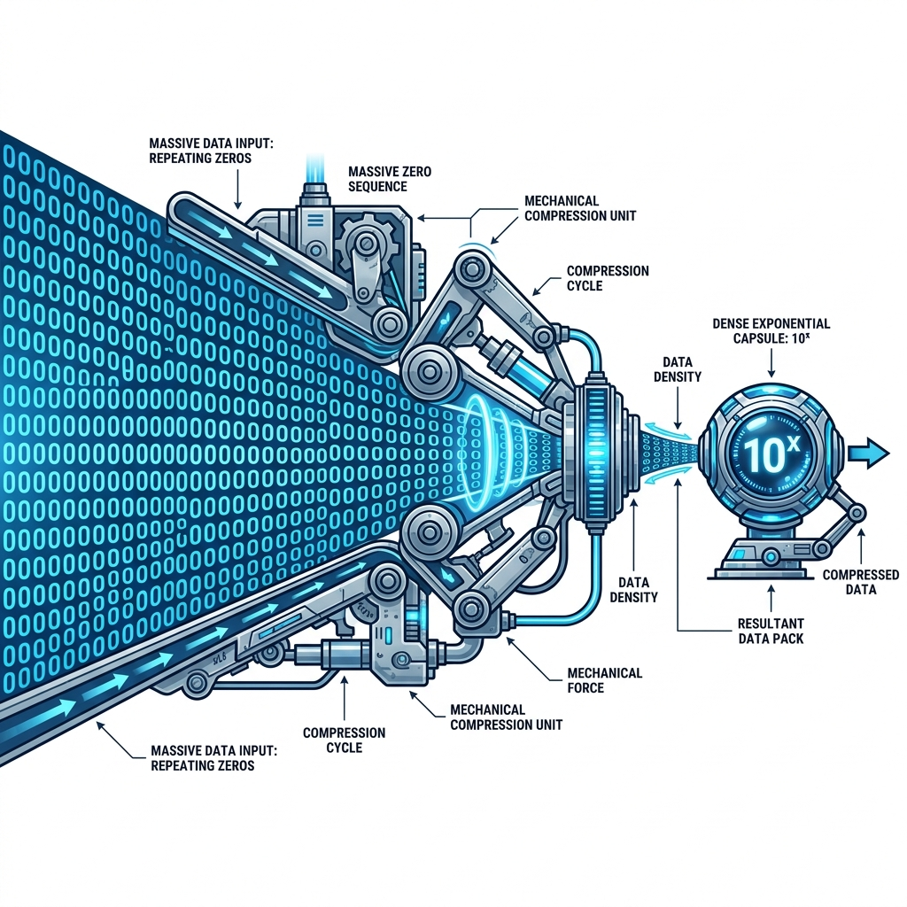
[IMAGE_PROMPT: A massive line of zeroes zip-compressing into a tiny capsule labeled '10^x'. Clean vector style, white background.]
> [!NOTE]
> **💡 AHA MOMENT:** Scientific notation acts as simple data packing for massive numbers of zeros.

**What it is:**
It is a shorthand method for writing extremely large or extremely tiny numbers.

**How to solve:**
Count the jumps from the original decimal point to the new location behind the first digit. Write that jump count as the exponent. $4,500,000$ becomes $4.5 \times 10^6$.

**Why it works in space:**
Instead of drawing a long flat line, you fold the distance onto itself into a small package that keeps the total length.

**Summary:**
Scientific notation manages massive sizes cleanly without wasting space.

---

## Chapter 4: The Scale and The Map (Equations & Geometry)

### Balancing Equations ($2x + 4 = 10$)
**Imagine a brass scale delicately hovering in perfect balance.**
If you remove a weight from the left side, the scale tilts. To fix it, you must remove the exact same amount from the right.
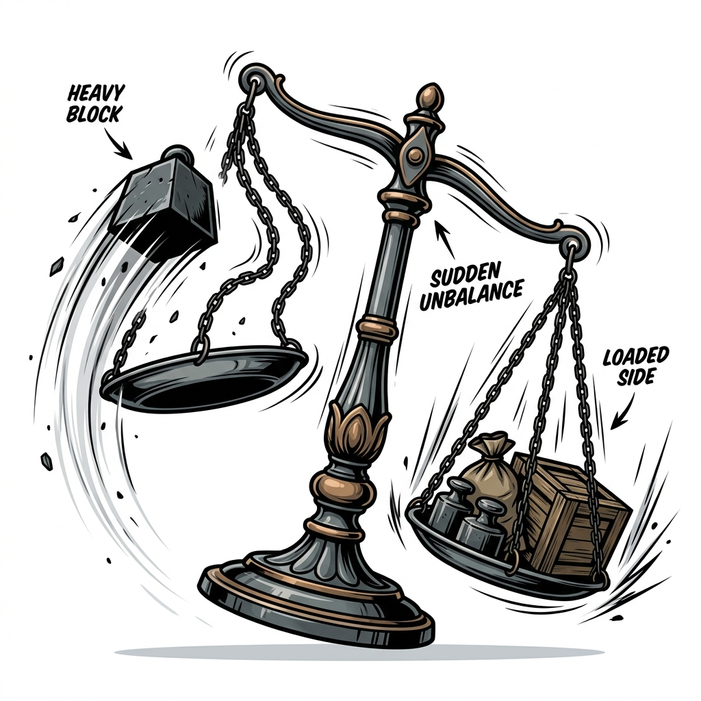
[IMAGE_PROMPT: A balance scale. The left plate shows a heavy block being removed, causing the right plate to dip downward. Flat vector style, white background.]
> [!NOTE]
> **💡 AHA MOMENT:** Equations require you to adjust both sides identically to maintain physical balance.

**What it is:**
An equation states that the left side and the right side are exactly equal, even if they look different.

**How to solve:**
Isolate the unknown letter. If the equation is $2x + 4 = 10$, subtract 4 from both sides to get $2x = 6$. Then divide both sides by 2 to find that $x = 3$.

**Why it works in space:**
A balanced shape must stay balanced. If you cut a block off the left side of a flat scale, you must cut the exact same block off the right side to keep it flat.

**Summary:**
You strip weights from both sides equally to expose the hidden value.

### Linear Lines ($y = mx + b$)
**Imagine aiming a laser pointer into the night sky from a specific step on a ladder.**
The constant '$b$' is the exact step on the ladder where the laser starts. The slope '$m$' is the angle of the beam pointing upward.
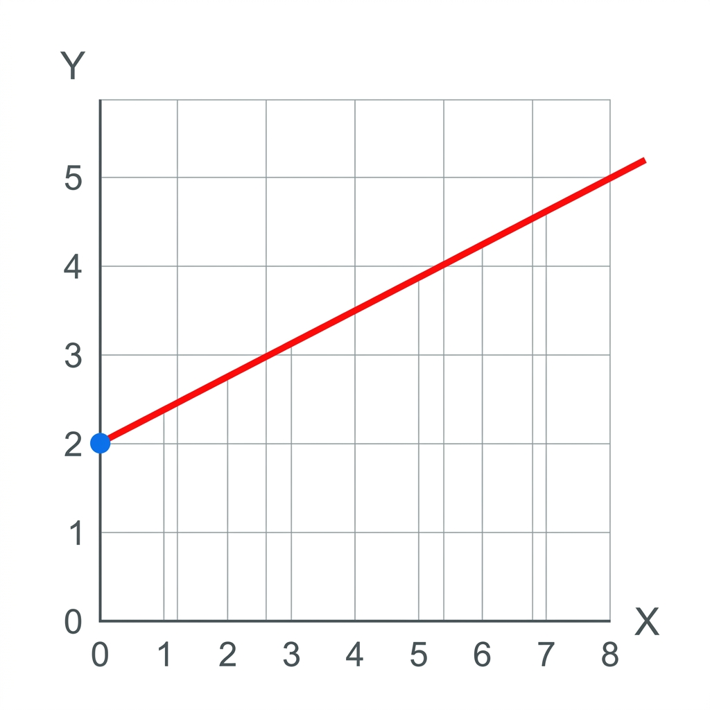
[IMAGE_PROMPT: A red laser beam originating from a blue dot on the Y-axis wall, angling upward across a minimal grid. Flat vector style, white background.]
> [!NOTE]
> **💡 AHA MOMENT:** A linear equation is the blueprint for a straight line.

**What it is:**
It is the standard equation used to draw straight lines predictably on a graph.

**How to solve:**
Mark your starting point on the vertical Y-axis using '$b$'. Look at the slope '$m$' as a fraction. Move up the 'rise' number, and right the 'run' number to plot your next dot.

**Why it works in space:**
The line climbs perfectly without bending, creating identical triangles at every step.

**Summary:**
Linear lines establish a starting height, set an angle, and travel straight forever.

### Percentages ($\%$)
**Imagine a transparent grid that slices any shape directly into exactly 100 equal sections.**
Percentages force different objects into the exact same 100-piece scale. "50%" indicates you select exactly half of those available sections.
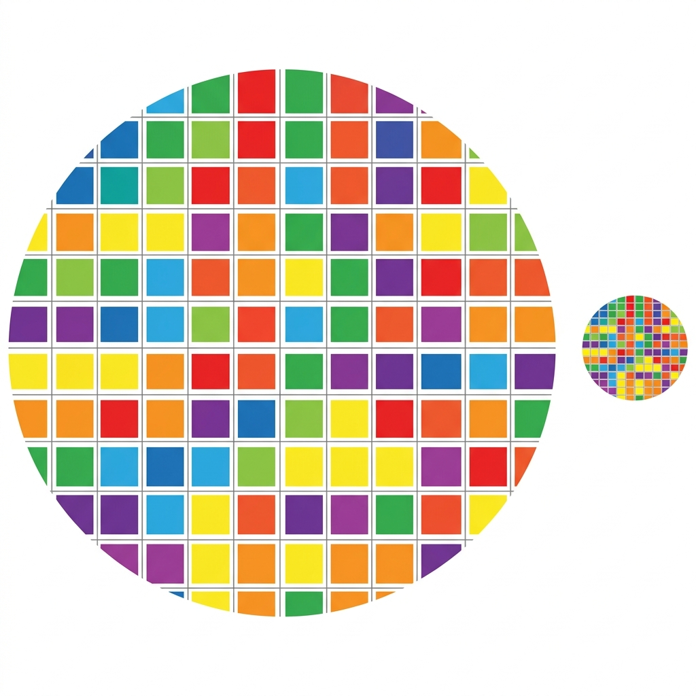
[IMAGE_PROMPT: A large circle and a tiny circle covered by an identical transparent grid composed of exactly 100 squares. Minimalistic vector style, white background.]
> [!NOTE]
> **💡 AHA MOMENT:** Percentages force completely different shapes into a universal 100-piece scale.

**What it is:**
A percentage is a ratio that compares a number specifically out of a set of 100.

**How to solve:**
To find 30% of a number, convert the percentage into a decimal by moving the dot two places left ($0.30$). Then multiply the original number by $0.30$.

**Why it works in space:**
You put a universal mask over random shapes. By chopping every object into 100 identical pieces, comparing sizes becomes easy.

**Summary:**
Percentages allow completely different sizes to share the exact same 100-piece grid.

### Percentage Increase/Decrease
**Imagine a grid of 100 blocks expanding outward to add 20 new edge pieces.**
Applying a 20% increase tells the system to attach 20 fresh blocks directly to the rim of the original shape.
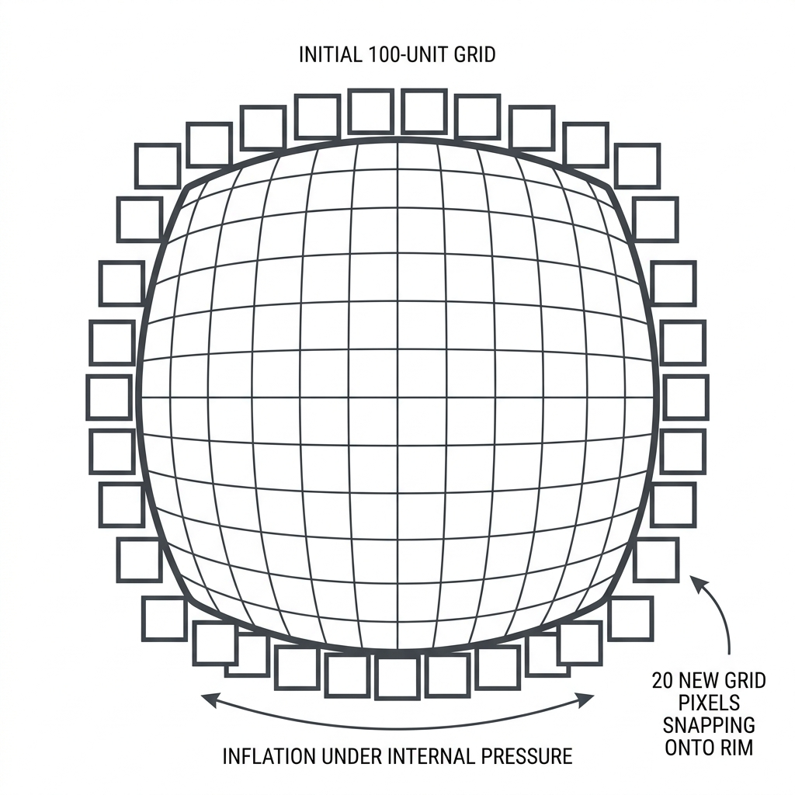
[IMAGE_PROMPT: A 100-unit square grid inflating outward, gaining 20 new external grid pixels snapping onto the rim. Minimalistic vector style, white background.]
> [!NOTE]
> **💡 AHA MOMENT:** Percentage increases add calculated modular blocks directly onto an existing structure.

**What it is:**
It calculates the exact amount a value grows or shrinks relative to its initial size.

**How to solve:**
To increase 50 by 20%, multiply $50 \times 1.20$. The '1' keeps the original value intact, while the '.20' calculates the brand new addition. The answer is 60.

**Why it works in space:**
Expansion snaps pieces directly onto the outside border. The shape widens evenly.

**Summary:**
You dynamically scale the object based on how many extra 100-scale blocks fall away or attach.

### The Coordinates Grid ($X$ and $Y$)
**Imagine walking through a city block grid using exact directions.**
To find a location, you determine a starting point, walk a precise number of units right (the $X$ axis), turn 90 degrees, and walk forward (the $Y$ axis).
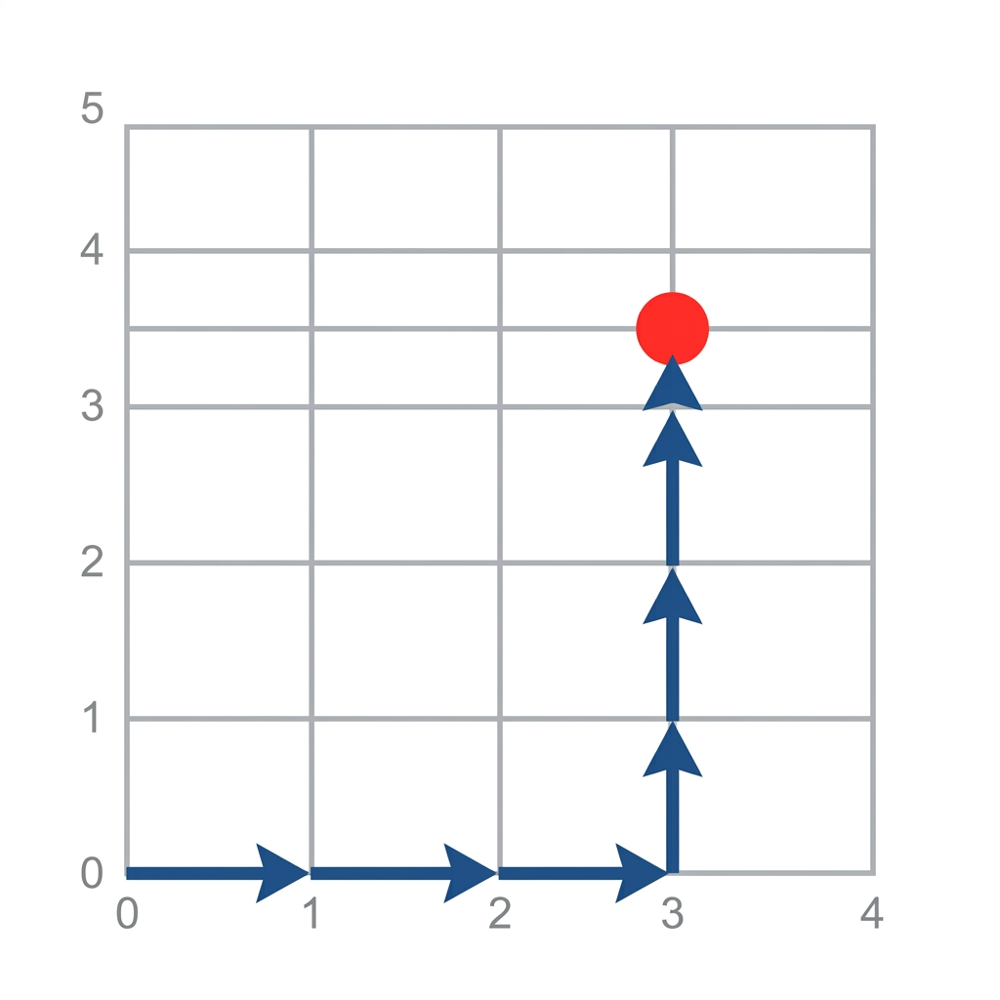
[IMAGE_PROMPT: A floor grid made of square tiles. A bright red target dot rests on a crossing. Arrows trace the path along the bottom edge, then straight upward to the dot. Flat vector style, white background.]
> [!NOTE]
> **💡 AHA MOMENT:** The coordinate system is a rigid map locating points perfectly.

**What it is:**
It is a 2D mapping system that uses a horizontal and vertical number line to pinpoint locations.

**How to solve:**
Plot the point $(3, -4)$. Start at the absolute center $(0,0)$. Move 3 units right on the X-axis. Move 4 units down on the Y-axis. Place your dot.

**Why it works in space:**
Coordinates pin shapes onto a flat floor. The grid stops a point from drifting away completely.

**Summary:**
Coordinates act as an irrefutable GPS map pinning geometry perfectly down.

### The Mathematics of Pi ($\pi$)
**Imagine a bicycle wheel with a wet tire rolling one full rotation along the pavement.**
The wet line left stamped onto the ground is exactly 3.14 times longer than the wheel's height.
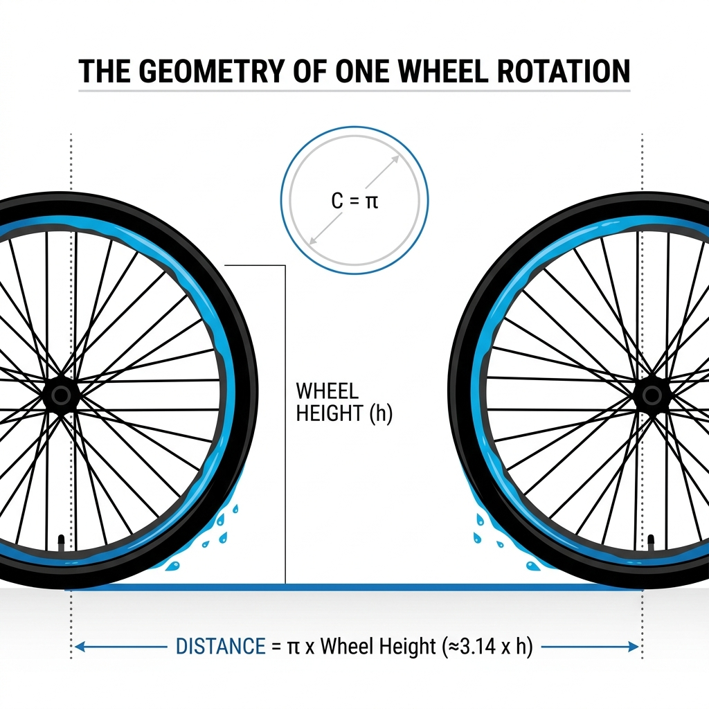
[IMAGE_PROMPT: A bicycle wheel with a wet edge rolling forward one full rotation, leaving a straight blue line exactly 3.14 times the wheel's height. Flat vector style, white background.]
> [!NOTE]
> **💡 AHA MOMENT:** Pi is the conversion rate for translating round shapes into flat distances.

**What it is:**
Pi is the ratio of a circle's outer circumference to its diameter, equaling approximately 3.14.

**How to solve:**
To find the circumference of a circle with a diameter of 10, multiply $10 \times 3.14$. The outer size will be exactly 31.4 units long.

**Why it works in space:**
When you peel the curved skin off a circle and lay it flat, it measures the exact same length every time.

**Summary:**
Pi is the fundamental tool to translate circular shapes into straight lines.

---

## Chapter 5: Hacking High-School Algebra

### Subtracting Different Shapes ($3x^2 - 6x$)
**Imagine attempting to slice a solid wooden desk using a piece of string.**
You cannot subtract $x$ from $x^2$. Because $x^2$ is a flat 2D square, while $x$ is a thin 1D line. You can only merge matching shapes.
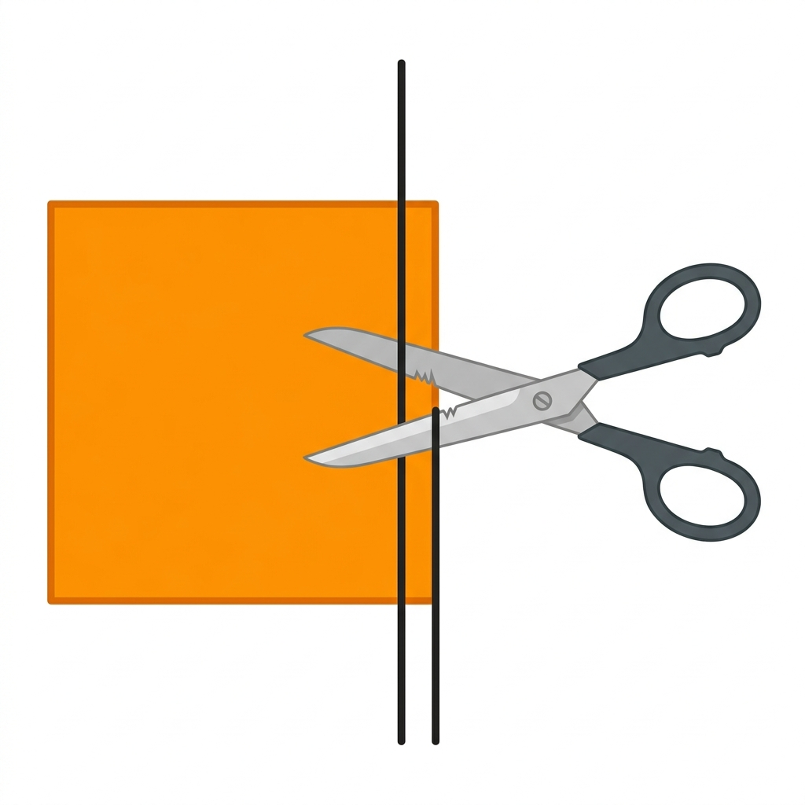
[IMAGE_PROMPT: A flat 2D square shape standing next to a thin 1D line. A pair of scissors attempts to cut the large 2D shape using the thin line. Flat vector style, white background.]
> [!NOTE]
> **💡 AHA MOMENT:** You cannot combine variables with different exponents because they represent different geometric shapes.

**What it is:**
In algebra, "like terms" dictate that you can only add or subtract terms possessing the exact identical letter and exponent.

**How to solve:**
If you have $4x^2 - x^2 + 5x$, combine only the matching exponents. Subtract $4x^2 - 1x^2$ to get $3x^2$. Leave the $+ 5x$ alone completely. The final answer is $3x^2 + 5x$.

**Why it works in space:**
Shapes cannot merge if they do not match. A solid box and a flat square cannot mix; they must sit beside each other separately.

**Summary:**
Algebra respects physical geometry. Match the box shapes perfectly before attempting to merge them.

### Parentheses with a Minus $-(x^2 - 6x)$
**Imagine an entire contained landscape flipping upside down.**
Placing a minus sign outside a parenthesis commands an absolute inversion. Every piece inside cleanly flips over.
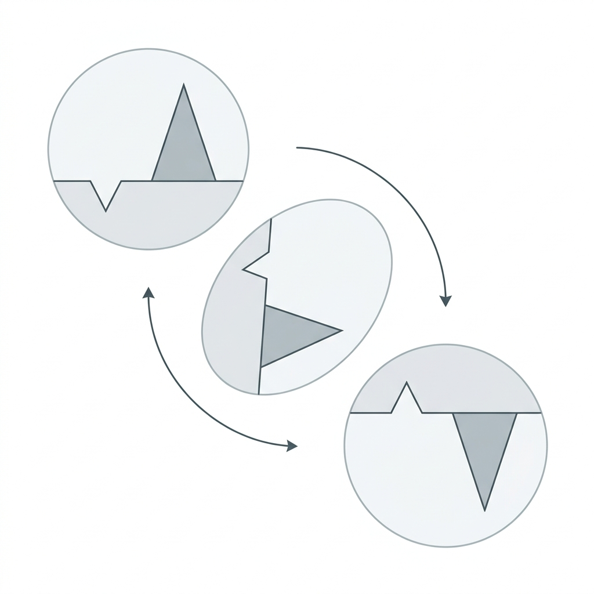
[IMAGE_PROMPT: A transparent boundary containing a green valley. The boundary rotates 180 degrees, flipping the valley into a tall mountain. Flat vector style, white background.]
> [!NOTE]
> **💡 AHA MOMENT:** A negative sign outside a bracket inverts everything inside into its exact opposite.

**What it is:**
It is the distributive property forcing a negative-one multiplier across every single term locked inside the bracket.

**How to solve:**
Take $-(4x - 5)$. Multiply the invisible $-1$ against both terms. The positive $4x$ becomes $-4x$. The negative $-5$ becomes $+5$. The final inverted answer is $-4x + 5$.

**Why it works in space:**
The minus sign acts as a reflective mirror on the grid. The entire bounded shape flips cleanly across the zero line, reversing all positions.

**Summary:**
The minus sign stationed before an equation block perfectly mirrors the entire internal shape.

### The Missing Center: $(a - b)^2 = a^2 - 2ab + b^2$
**Imagine a large square plot of land where developers dig two intersecting pathways.**
When they carve the pathways horizontally and vertically, the dead center intersection is dug out twice. To prevent a hole in the pavement, they drop a small patch of material ($+b^2$) directly into the gap.

[IMAGE_PROMPT: A solid square plot with two intersecting empty trenches forming a cross. In the center intersection, a square block is dropped in as a plug. Flat vector style, white background.]
> [!NOTE]
> **💡 AHA MOMENT:** The $+b^2$ physically serves as the necessary patch repairing the accidentally over-dug center intersection.

**What it is:**
It is an expansion formula that calculates the true total area when a side is shortened.

**How to solve:**
To expand $(x - 3)^2$, do not just write $x^2 - 9$. You must apply FOIL (First, Outer, Inner, Last). Multiply $(x - 3)(x - 3)$ to get $x^2 - 3x - 3x + 9$, which simplifies to $x^2 - 6x + 9$.

**Why it works in space:**
Removing crossing rectangles creates a double-dug hole at the crossing point. You must add that square piece back to fix the total area.

**Summary:**
Formulas are structural corrections to fix areas where pieces were dug out twice.

---

## Chapter 6: The Harmony of Fractions

### The Common Denominator ($\frac{1}{3} + \frac{1}{4}$)
**Imagine forcing a puzzle piece with three wide stripes to lock into a space cut for four thin stripes.**
They do not fit. You must pass both shapes through a tool that cuts them entirely into 12 identical, smaller squares before they can connect.

[IMAGE_PROMPT: Two mismatched puzzle blocks being fed into a calibrator, which outputs them as perfectly identical fine square grids. Flat vector style, white background.]
> [!NOTE]
> **💡 AHA MOMENT:** Common denominators standardize fragmented pieces into identically sized grids so they can merge.

**What it is:**
It is a scaling process ensuring two fractions use the exact same base slice size before combining.

**How to solve:**
To add $\frac{1}{3} + \frac{1}{4}$, find a common multiple for the bottoms (12). Multiply the first fraction by $\frac{4}{4}$ to get $\frac{4}{12}$. Multiply the second by $\frac{3}{3}$ to get $\frac{3}{12}$. Add the tops to get $\frac{7}{12}$.

**Why it works in space:**
Merging pieces requires matching lines. You must slice different grids into the exact same piece size so they fit together perfectly.

**Summary:**
Adding fractions requires you to cut completely different shapes into an identical pixel size.

### Dividing by a Fraction ($\frac{a}{b} \div \frac{c}{d}$)
**Imagine a parachute catching wind, only to be inverted inside out to become a sail.**
Division generally acts as a brake. However, when you divide by a fraction, the direction flips. It transforms into forward movement, accelerating your system.

[IMAGE_PROMPT: A large open parachute gently inverted inside out forming a sleek forward-facing sail. Clean vector style, white background.]
> [!NOTE]
> **💡 AHA MOMENT:** Dividing by a fraction mathematically flips the math, increasing your size instead of shrinking it.

**What it is:**
It calculates how many tiny slices fit fully inside a larger primary number.

**How to solve:**
To solve $\frac{1}{2} \div \frac{1}{4}$, retain $\frac{1}{2}$, change division to multiplication, and flip $\frac{1}{4}$ to make $\frac{4}{1}$. Multiply across to get $\frac{4}{2}$, which simplifies to 2.

**Why it works in space:**
Division breaks shapes into pieces. Dividing by a number smaller than 1 flips the process. The shape stretches outward, making more parts than you originally started with.

**Summary:**
When division flips, the shape grows outward instead of shrinking.

---
---

# PART 2: THE EXPANDED MAP (Roadmap Directory)

## Block A: Essential Arithmetic

### Order of Operations (PEMDAS)
**Imagine an assembly line painting a car's exterior before the doors are welded onto the frame.**
Mathematics relies on strict chronological steps. Parentheses must resolve first, followed securely by exponents. Then multiplication runs, leaving addition to finalize the numbers last.

[IMAGE_PROMPT: A clean factory line processing a block in order: Parentheses first, Exponents second, Multiplication third, Addition last. Flat vector style, white background.]
> [!NOTE]
> **💡 AHA MOMENT:** PEMDAS enforces a necessary workflow to prevent the calculation from collapsing.

**What it is:**
It is the universally agreed sequence used to solve math problems featuring multiple symbols.

**How to solve:**
Solve $5 + 2 \times (3^2)$. First do Exponents: $3^2 = 9$. Next do Multiplication: $2 \times 9 = 18$. Last do Addition: $5 + 18 = 23$.

**Why it works in space:**
Pulling a shape upward into a box must happen before trying to lay smaller flat sheets next to it.

**Summary:**
Ignoring the schedule guarantees you will try to add fragile pieces to a block that hasn't fully materialized.

### Even and Odd Numbers
**Imagine neatly stacking building blocks side by side into pairs.**
Even sets stack flawlessly into flush rows. Odd sets invariably leave exactly one uneven block sticking upward.

[IMAGE_PROMPT: Two columns of identical blocks. The left column features a flat top edge. The right column has one upper block protruding vertically. Flat vector style, white background.]
> [!NOTE]
> **💡 AHA MOMENT:** Odd numbers invariably contain one structurally unmatched foundational block.

**What it is:**
Numbers ending in 0, 2, 4, 6, 8 divide perfectly by two. Odd numbers end in 1, 3, 5, 7, 9.

**How to solve:**
Analyze the final digit of the integer. If $3,457$ ends in 7, you instantly determine it cannot divide evenly by two.

**Why it works in space:**
Matching sides create clean shapes. Blocks pair perfectly unless one leftover block breaks the flat line.

**Summary:**
Splitting an odd number in halves will always violently break that lone top block.

### Long Division
**Imagine wielding a heavy chisel to extract material from a solid stone boulder.**
You don't shatter the entire piece instantly. You carefully chisel out massive square chunks first, brush them aside, and systematically cut the remainder.

[IMAGE_PROMPT: A chisel actively carving giant square chunks out of a monolithic boulder, leaving only smaller jagged debris falling. Flat vector style, white background.]
> [!NOTE]
> **💡 AHA MOMENT:** Long division methodically removes standardized blocks until only debris remains.

**What it is:**
It is an algorithm for breaking massive numbers into manageable sub-group calculations step-by-step.

**How to solve:**
Follow the Divide, Multiply, Subtract, Bring down cycle. Divide the outer divisor into the first digits of the inner number. Subtract the product, drop the next unused digit down, and repeat.

**Why it works in space:**
Stripping size from a massive rock is done from large chunks down to tiny pieces.

**Summary:**
The mathematical remainder is simply the final jagged pieces of stone left on the ground.

### Decimals
**Imagine locking your gaze on a single floor tile, then peering through a microscope to analyze the smaller grid lines inside.**
Decimals represent the microscopic geometry between whole numbers. Passing the decimal point shifts your scale into sub-units.

[IMAGE_PROMPT: A solid square zooming effortlessly down into a microscopic base grid where ten tinier identical sub-squares rest beneath a magnifier. Minimalistic vector style, white background.]
> [!NOTE]
> **💡 AHA MOMENT:** Shifting into decimals is zooming your perspective into the microscopic layer of a single unit.

**What it is:**
A system utilizing a dot marker to denote pieces of a whole shape grouped precisely by tens.

**How to solve:**
To add $1.4$ and $0.25$, align the dots vertically, filling empty gaps with zeros. Add $1.40 + 0.25$ directly down the straight columns to get $1.65$.

**Why it works in space:**
The decimal structure acts exactly like whole shapes but shrinks them down. The grid zooms inward while keeping the exact same layout.

**Summary:**
You perform calculations with identical rules; you are simply operating on a securely contained microscopic scale.

### Rounding Numbers
**Imagine rolling a metal sphere along a track between two powerful magnets.**
If the sphere crosses the halfway mark, the upper magnet asserts control and snaps it upward. If it falls short, gravity rolls it back down to baseline.

[IMAGE_PROMPT: A metal ball balancing exactly at the center peak of an arched bridge before snapping down to the nearest colored magnet. Clean vector style, white background.]
> [!NOTE]
> **💡 AHA MOMENT:** Rounding allows the closest anchor to pull a decimal dynamically into place.

**What it is:**
It truncates overly precise numbers to a clean, manageable value based on proximity.

**How to solve:**
Look at the adjacent digit to the right of your target rounding point. If it is 5 or higher, round your target digit upward. If it is 4 or lower, leave your target digit alone and zero the rest.

**Why it works in space:**
Geometric instability resolves to the nearest stable lock point. You discard excessive micro-data to maintain a clean layout.

**Summary:**
When precise resolution is unnecessary, rounding provides the number a clean docking point.

### Least Common Multiple
**Imagine observing two gears with vastly different tooth counts engaging each other.**
The least common multiple is the exact future moment when the painted markers on both wheels simultaneously hit the top apex in total synchronization.

[IMAGE_PROMPT: Two overlapping gears of different sizes featuring a single bright sync-line cleanly aligning at the absolute center mark. Flat vector style, white background.]
> [!NOTE]
> **💡 AHA MOMENT:** The LCM signifies the moment unaligned cycles intersect in perfect harmony.

**What it is:**
It identifies the smallest positive number perfectly divisible by both starting integers.

**How to solve:**
List the multiples. To find the LCM of 4 and 6, write out: $4, 8, 12, 16$. Then list $6, 12, 18$. The first identical match encountered is 12.

**Why it works in space:**
Repeating lengths must eventually overlap perfectly. The LCM finds the exact first point where both lines lock together.

**Summary:**
It is the sync point for events operating on separate cyclical timers.

### Fraction Ratios & Proportions
**Imagine mixing a small cup of potent liquid, then scaling the formula to fill a vat without altering the taste.**
Proportions lock variables together. As one side scales upward, the other side is rigidly stretched in tandem to maintain consistency.

[IMAGE_PROMPT: A small glass of liquid connected tightly by a rigid rod to a massive industrial vat of identical liquid. Flat vector style, white background.]
> [!NOTE]
> **💡 AHA MOMENT:** Proportions act as a locking tether, ensuring ratios survive immense scaling.

**What it is:**
A proportion asserts that two distinct fractions denote the identical ratio.

**How to solve:**
Use cross-multiplication. For $\frac{2}{5} = \frac{x}{15}$, multiply diagonal elements. $2 \times 15 = 30$. Next, equate it to the other diagonal: $5x = 30$. Divide by 5 to find $x = 6$.

**Why it works in space:**
Expanding a shape proportionally stretches all sides at once. The core shape survives massive stretching easily.

**Summary:**
Scaling proportionally ensures internal parameters remain completely untouched regardless of overall size.

### Equivalent Fractions
**Imagine scoring a baked pizza carefully into eight precise slices instead of cutting it cleanly down the middle.**
You are not manipulating the physical slice. Equivalent fractions dictate applying a denser measuring grid across the identical amount of shape.

[IMAGE_PROMPT: Two identical solid pizzas side by side. The left is sliced into halves, the right is sliced intricately into eighths. Flat vector style, white background.]
> [!NOTE]
> **💡 AHA MOMENT:** You don't alter sizes; you mathematically increase the resolution of the tracking grid.

**What it is:**
Fractions containing completely different numbers that represent exactly the same proportional coverage.

**How to solve:**
Multiply the top and bottom values by the identical constant. Multiply $\frac{1}{2}$ by 3 on top and 3 on the bottom to generate an equivalent $\frac{3}{6}$.

**Why it works in space:**
Cutting existing blocks strictly into more slices never changes the total amount. You simply cut more lines.

**Summary:**
Equivalent fractions provide the flexibility to bridge equations without inflating base pieces.

### Conversions (Fraction ↔ Decimal ↔ %)
**Imagine assessing the weight of a solid block while documenting its properties simultaneously in three languages.**
Fractions ($1/4$), Decimals ($0.25$), and Percentages ($25\%$) act as simple linguistic variations. They describe the identical physical block, prioritizing different frameworks.

[IMAGE_PROMPT: A single blue block viewed straight through three distinct lenses: rendering a fraction, a decimal dot scale, and a percentage grid. Clean vector style, white background.]
> [!NOTE]
> **💡 AHA MOMENT:** Conversions only shift the mathematical language used, preserving the foundational shape flawlessly.

**What it is:**
It transfers identical values effortlessly across formatting syntax to accommodate varying test operations.

**How to solve:**
To turn a fraction into a decimal, divide the top number by the bottom. $\frac{1}{4}$ means $1 \div 4$, giving $0.25$. Shift the decimal two steps right to finalize the percentage as 25%.

**Why it works in space:**
Lenses observing a solid form don't warp reality. The block remains firmly anchored to the spatial grid while varying analytical overlays highlight specific traits.

**Summary:**
You leverage conversions entirely because certain calculations process smoother under specific formatting rules.

## Block B: Algebra Extensions

### Factoring Expressions
**Imagine receiving a sealed cubic container and methodically peeling the seams apart until the cardboard lies perfectly flat.**
While expanding an equation constructs a solid box, factoring systematically reverse-engineers the process, breaking the solid safely down into flat piece layouts.

[IMAGE_PROMPT: A solid square box peacefully peeling open at its straight seams to lie flat on a grid as separate, perfectly measured segments. Minimalistic vector style, white background.]
> [!NOTE]
> **💡 AHA MOMENT:** Factoring reduces a securely glued object back to its elemental building materials.

**What it is:**
The process of locating absolute base multipliers that recreate an expanded expression when combined.

**How to solve:**
Isolate the Greatest Common Factor. For $6x + 9$, extract the shared number 3. Place the 3 outside the bracket to generate the factored answer $3(2x + 3)$.

**Why it works in space:**
Deconstructing a shape reveals the underlying base edges. A connected shape smoothly splits back into its core flat lines.

**Summary:**
You factor algebraic structures to identify the exact base lines initially compiled to build the form.

### Inequalities (< and >)
**Imagine a brass scale where one side is secured firmly to the ground by an iron anchor.**
The equation will never gracefully achieve equilibrium. The expansive jaw symbol consistently targets the tray possessing the heavier mass.

[IMAGE_PROMPT: A physical scale permanently tilted heavily to one side, held down by a large chained anchor weight. Flat vector style, white background.]
> [!NOTE]
> **💡 AHA MOMENT:** Inequalities document an ecosystem maintaining a permanent imbalance.

**What it is:**
A mathematical rule conveying that a defined value is absolutely heavier or lighter than a comparative target point.

**How to solve:**
Solve it identically to equal signs, isolating $x$. However, if you multiply or divide across the inequality via a negative number, you must physically reverse the symbol ($<$ becomes $>$).

**Why it works in space:**
When you apply a negative sign, the entire shape flips over. The heavy side flips directly across to the opposite side.

**Summary:**
Multiplying by a negative forcefully inverts the spatial flip, cleanly rotating the heavy anchor across to the opposing tray.

### Substitute Variables
**Imagine a marked, vacant stall reserved for a specific component to be safely dropped directly into position.**
Abstract variables act as empty parking stalls. Substitution extracts the placeholder strictly, and seats the precise numeric value smoothly into the cleared void.

[IMAGE_PROMPT: A glowing geometric void shaped like an 'X' resting on the floor, into which a solid metallic block featuring a '5' drops flush. Minimalistic vector style, white background.]
> [!NOTE]
> **💡 AHA MOMENT:** Substitution seamlessly occupies abstract voids with measurable physical pieces.

**What it is:**
The action of trading an unknown algebraic letter explicitly for an assigned fixed constant immediately prior to solving.

**How to solve:**
If $y = 3x + 2$ and you determine $x = 4$, overwrite the $x$ symbol. Process $y = 3(4) + 2$. Standard multiplication executes properly to finalize $y = 14$.

**Why it works in space:**
Equations represent vacant molds waiting for physical input geometry to trigger the complete spatial construction process.

**Summary:**
Once the numeric block is cleanly seated, the abstract framework locks down and calculates reliably.

### Negative Dimensions (Inverse Exponents)
**Imagine an expanding perimeter abruptly retreating on itself, collapsing smoothly down an open trapdoor.**
An exponent carrying a minus ($x^{-2}$) acts as an internal elevator, drawing your geometric object securely down into the fractional plane underneath ($\frac{1}{x^2}$).

[IMAGE_PROMPT: A geometric sphere collapsing inward into a point, dropping straight through an open trapdoor installed in a hard floor. Flat vector style, white background.]
> [!NOTE]
> **💡 AHA MOMENT:** Inverse exponents act safely as elevators, transferring objects neatly downward into fractional slices.

**What it is:**
Negative powers denote reciprocal mathematical division inherently translating downward over zero.

**How to solve:**
Drop the term under a fraction line. A base $3^{-2}$ swiftly transitions into $\frac{1}{3^2}$. That quickly evaluates perfectly into $\frac{1}{9}$.

**Why it works in space:**
Growth is redirected inwards. Scaling happens below the floor, breaking space into tiny fraction pieces rather than massive squares.

**Summary:**
Rather than scaling upward to dominate space, the form gracefully condenses deeply inward.

## Block C: Deep Geometry

### Perimeter vs Area
**Imagine erecting a secure boundary fence, opposed to pouring a solid concrete floor across the same compound.**
The perimeter is exclusively the rigid 1D line wrapping the perimeter. The area is the dense 2D density entirely consuming the internal floor layout.

[IMAGE_PROMPT: A thin external outline of a square positioned next to an identical outline completely filled with solid dark concrete. Flat vector style, white background.]
> [!NOTE]
> **💡 AHA MOMENT:** Perimeter accurately tracks the outer wrap; Area systematically calculates the solid internal fill.

**What it is:**
Perimeter totals the measurable outside border length. Area quantifies the flat surface strictly captured inside that boundary.

**How to solve:**
To find the perimeter of a rectangle, total all 4 external side line lengths. To find the internal Area, cleanly multiply length by height just once.

**Why it works in space:**
Borders lock flat lines tightly together. Area activates the fill tool to paint completely across the inside.

**Summary:**
An elongated, thin courtyard inherently commands a massive perimeter while retaining negligible interior area.

### Volume Expansion
**Imagine analyzing a flat foundational floor plan, and smoothly pulling the blueprints vertically to form the roof.**
Volume securely integrates depth. By validating the flat surface area initially on the ground, you pull the walls vertically to finalize the 3D tank structure.

[IMAGE_PROMPT: A flat 2D square naturally extruding its corners upward into a transparent cube tank, slowly filling with blue water. Flat vector style, white background.]
> [!NOTE]
> **💡 AHA MOMENT:** Volumetric growth is pulling a confirmed 2D base vertically across the Z-axis.

**What it is:**
A volumetric quantification of total 3D cubic capacity enveloped within an overarching three-dimensional shape bounds.

**How to solve:**
Find the flat Area ($L \times W$) of the foundation base first. Multiply that Area figure securely by the height measurement to instantly ascertain Volume capacity.

**Why it works in space:**
Shapes pull straight upward to construct depth. A flat circle pulled straight up seamlessly creates a cylinder.

**Summary:**
Spherical objects ultimately rely entirely on the exact same logic of continuous depth expansion.

### Understanding Angles
**Imagine a solid vault door anchored perfectly, swinging open against a solid wall.**
Angles disregard linear tracking cleanly. They exist strictly to document clean rotation. An angle is the meticulous log of the exact degree a hinge rotates before halting.

[IMAGE_PROMPT: A heavy wooden door seen from above, opened away from a straight wall, leaving a red arc clearly tracing its rotational swing path. Flat vector style, white background.]
> [!NOTE]
> **💡 AHA MOMENT:** Angles gracefully record the precise arc of rotational swing, independently of raw length.

**What it is:**
A numerical notation representing the exact fractional spatial opening extending seamlessly between two intersecting rigid line segments.

**How to solve:**
A full circle logs 360 degrees. A perpendicular corner establishes 90 degrees strictly. Subtract interior corners from 360 to navigate exterior sweeping angles accurately.

**Why it works in space:**
Rotation measures how far two lines split. An angle measures the swinging arc without changing the straight line lengths.

**Summary:**
A door swung entirely open, snapping flush back against the wall, perfectly yields an unbending 180-degree sweep.

### Polygons
**Imagine sealing three metallic bars intimately together to construct an impenetrable enclosure.**
A polygon translates to "many angles". It denotes cleanly locking straight edges smoothly together, isolating the enclosed space completely from the expanse outside.

[IMAGE_PROMPT: Three floating straight metal rods snapping its corners perfectly together to form a highly impenetrable 2D solid triangle. Flat vector style, white background.]
> [!NOTE]
> **💡 AHA MOMENT:** Polygons effectively execute secure borders, separating the measured interior reliably from the invalid exterior.

**What it is:**
A completely enclosed planar 2D shape composed solely of flawlessly connecting rigid line segments.

**How to solve:**
Examine the exterior edge. If curved sectors exist, or if an outer line fails to intercept completely exposing an open geometric breach, the figure utterly fails the polygon definition.

**Why it works in space:**
A shape must be completely closed and locked before the math can safely calculate the inside area without leaking.

**Summary:**
Only when the perimeter is closed and leak-proof does the system respectfully grant the enclosed area calculable status.

### Triangles
**Imagine stabilizing an open square frame opposed to securing a strict three-bar frame.**
Triangles exist as the ultimate standard of mechanical robustness. They are the only fundamental configuration capable of ensuring an object cannot fold without snapping the beams.

[IMAGE_PROMPT: A wobbly open square frame sitting next to a highly secure triangular frame cleanly enduring heavy top-down pressure without bending. Flat vector style, white background.]
> [!NOTE]
> **💡 AHA MOMENT:** Triangles systematically serve as the indestructible core bracing of virtually all geometric architecture.

**What it is:**
A precise 3-sided polygon retaining interior rotational angles reliably evaluating rigidly to a mandatory total of exactly 180 degrees.

**How to solve:**
If two internal angles log 50 and 60 degrees, total them yielding 110. Subtract the 110 sum reliably from the 180 absolute ceiling to confirm the final unknown corner evaluates to 70 rigidly.

**Why it works in space:**
Rigid shapes cannot bend. Flat squares can warp easily sideways. Triangles lock the inside space, stopping all bending entirely.

**Summary:**
Pushing on a standard square gently collapses it laterally into a diamond. A triangle simply absorbs the pressure and pushes firmly back.

### Pythagorean Theorem
**Imagine welding two square plates strictly to the base and height of a solid right triangle frame.**
If those original square plates undergo a meltdown, their combined matter seamlessly fills an exact single square mold aligned perfectly over the long diagonal span.

[IMAGE_PROMPT: A right-angled triangle with a blue 2D square attached to its base and a red 2D square attached to its height. Both flow cleanly into a massive purple square aligned on the long diagonal. Flat vector style, white background.]
> [!NOTE]
> **💡 AHA MOMENT:** The theorem dictates the two smaller square shapes reliably merge to establish the expansive diagonal area.

**What it is:**
A rigid geometric formula ($a^2 + b^2 = c^2$) documenting specific length relationships native strictly inside right-angled structures.

**How to solve:**
If a short edge is 3 and another is 4, square them yielding 9 and 16. Combine them reaching 25. Determine the standard root of 25 to securely find the unknown hypotenuse diagonal logs 5 exactly.

**Why it works in space:**
Right angle corners lock their stretching areas together perfectly, showing that the two smaller square sizes directly match the large diagonal square size.

**Summary:**
Whenever you identify a strict 90-degree corner block, you possess the framework to calculate its diagonal span logically.

### Distance on a Grid
**Imagine tracing an erratic staircase across city blocks, and drawing a taut laser tape perfectly across the void to your destination.**
The distance formula circumvents counting tedious $X$ and $Y$ steps, forcing the grid to draw a clean diagonal line across the map layout.

[IMAGE_PROMPT: A clean X/Y map floor spanned diagonally by an intensely glowing unbroken measuring tape drawn taut between two coordinate dots. Minimalistic vector style, white background.]
> [!NOTE]
> **💡 AHA MOMENT:** The distance calculation simply drives an indestructible diagonal wedge directly into the coordinate system.

**What it is:**
A method to quantify absolute linear span between dots stationed haphazardly over a dual-axis grid map.

**How to solve:**
Record the absolute X tracking shift across both coordinates. Square that difference. Process the identical action for Y coordinates. Combine those yields securely, and extract the root.

**Why it works in space:**
The grid is built entirely of invisible right angles. Connecting two random dots carves a straight diagonal bridge cleanly across the completely empty space.

**Summary:**
You bypass the strict structural rectangular pathways entirely, extracting the absolute straight-line bridge instantly.

## Block D: Real-world Applications & Statistics

### Mean and Median
**Imagine distinct tanks housing varying volumes of liquid securely attached via an under-pipe vault.**
The Mean shifts fluid across all columns perfectly evenly. The Median completely ignores the liquid shift, selectively identifying solely which column stands systematically in the absolute middle position based purely on height.

[IMAGE_PROMPT: Three uneven vertical cylinders filled with fluid connected securely by a lower conduit pipe. Fluid sloshes into the pipes before finding a perfectly flat equilibrium level. Action vector style, white background.]
> [!NOTE]
> **💡 AHA MOMENT:** The Mean fairly distributes pieces; the Median simply observes sequential height hierarchy.

**What it is:**
Central diagnostics evaluating the average fluid weight (Mean) versus locating the absolute structural centerline sample unit (Median).

**How to solve:**
Mean: Total all numeric items together aggressively, and divide strictly by the exact counting number of unit participants. Median: Sort all numbers structurally low to highest, crossing end caps off until uncovering the middle survivor.

**Why it works in space:**
Fluid flowing naturally levels all uneven heights (Mean). Standing things in a row easily finds the middle item without modifying the group (Median).

**Summary:**
A highly unequal shape skews the Mean completely, while the Median remains comfortably insulated from the chaotic surge.

### Percentages in the Wild (Discounts & Interest)
**Imagine an active cost structure accurately logged as a uniform 100-block assembly.**
Discounts systematically sever chunks natively off the main block structure to streamline the output. Interest acts in reverse, securing an additional steady chunk solidly into your reserves over time.

[IMAGE_PROMPT: A price tag attached heavily to a wooden block, smoothly scaling down under a bright magnifying glass labeled 'Discount 20%'. Clean flat vector style, white background.]
> [!NOTE]
> **💡 AHA MOMENT:** Discounts selectively dismantle structural pricing blocks, while Interest reliably expands the core footprint securely.

**What it is:**
Pragmatic applications scaling arbitrary dynamic values universally off a percentage 100-baseline logic standard strictly.

**How to solve:**
Item lists at 80 dollars. Store applies 20 percent discount. Multiply 80 against .20 to isolate 16 dollars reduction exactly. Subtract 16 cleanly from 80 leaving final structure total safely at 64.

**Why it works in space:**
Value growth scales proportionally. Expansion rules stretch or shrink money amounts perfectly using the standard 100-piece block.

**Summary:**
Utilizing a precise 100-chunk scale securely enables complex market data to stretch or shrink coherently.

### Intro to Functions (The Gateway)
**Imagine interacting directly with a reliable diagnostic machine.**
A function ($f(x)$) confidently serves as a literal structural processor. You consistently submit a strict variable component directly into the hopper, and reliably acquire the accurately processed component smoothly ejected out the return shaft.

[IMAGE_PROMPT: A raw mathematical gear manufacturing machine accepting a solid block marked 'X', forcefully processing it, and delivering a polished sphere marked 'Y' into a basket. Clean vector style, white background.]
> [!NOTE]
> **💡 AHA MOMENT:** A function fundamentally operates precisely as an undeniable, rigorously structured process flow component.

**What it is:**
A strictly governed relation formula where every isolated input mapping guarantees delivery exclusively outputting a single verifiable output coordinate solidly.

**How to solve:**
Given $f(x) = 2x + 4$, test input $x$ safely at 3. Overwrite $x$ generating $f(3) = 2(3) + 4$. The factory multiplication runs accurately to 6, adding 4 reliably yielding exact output 10 completely.

**Why it works in space:**
The grid enforces strict rules. Dropping a number into the machine ensures the output safely follows a predictable, repeating path on the graph.

**Summary:**
Clean functions faithfully guarantee an uncorrupted predictable shape passing directly from the input straight line to final processing output.
