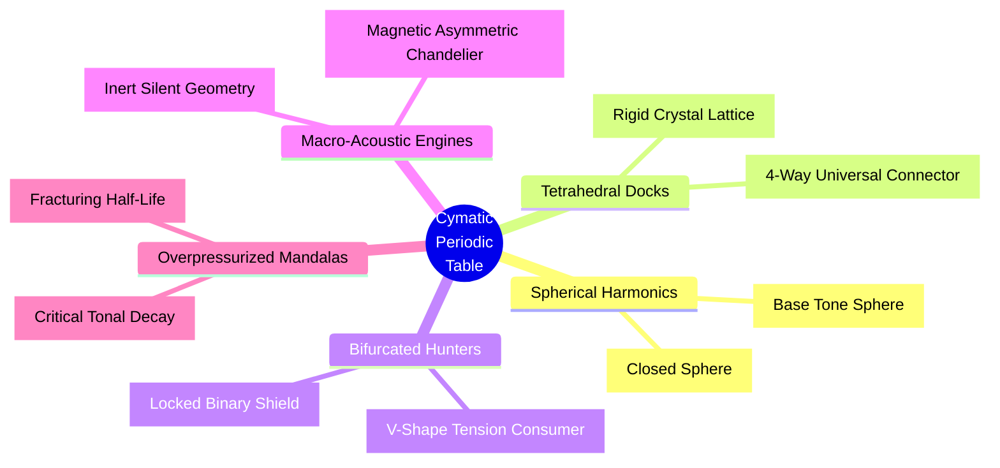

# [EXTENSION] Lineum Standard Model and Cymatic Periodic Table

**Document ID: 06-core-ext-lineum-standard-model
**Document Type:** Extension
**Version:** 1.0.0
**Status:** Draft
**Date:** 2026-03-05

## 1. Introduction: The End of the "Flying Marbles" Theory
Modern physics often explains atoms in layman's terms as a tiny solar system, where a heavy nucleus (the sun) sits in the middle, and tiny solid balls called electrons (planets) physically orbit around it. Lineum and the Eq-7 equation completely refute this model. There are no solid balls. There is only the continuous $\Psi$ fluid. 

Particles are not isolated point-objects. They are specific **geometric shapes of turbulence and vortices** locked within this fluid.

## 2. Lineum Standard Model (Particle Geometry)

In the Eq-7 universe, we distinguish elementary particles only by the specific shape into which the water (the $\Psi$ field) has been twisted:

1. **Photon (Light):** The simplest shape. It is a clean, straight forward-moving wave. It travels without any curling or folding (it does not knot). Because it does not knot, it does not generate sustained background pressure $\Phi$ around itself – in layman's terms: **it has no rest mass**.
2. **Electron ($1.2 \times 10^{20}$ Hz):** A perfect **smoke ring** (a toroidal vortex). The water has connected back onto itself and rotates in perfect symmetry. Thanks to this flawless equilibrium, the electron is immensely stable and almost never perishes on its own.
3. **Quarks ($5.3 \times 10^{20}$ Hz):** These are *broken, asymmetrical rings*. They rotate at a crooked angle and constantly "splash" water around themselves. Due to this frantic asymmetry, they ruthlessly scratch against the $\Phi$ pressure, creating a massive structural tension around them (we call these **Gluons**). To calm this tension down, they must always group up into triplets (e.g., to form a Proton). Their three asymmetrical angles lock into one another and form an outwardly stable knot.
4. **Neutrino:** A microscopic speck of rotation. It spins so intimately close to absolute zero (the rest baseline) that it evokes almost zero resistance in the fluid. Therefore, a neutrino can fly through the entire planet Earth while the Eq-7 grid barely notices it.

## 3. What is Electricity?
If the electron is a "perfect smoke ring" of water, what exactly is the electricity flowing through our wires?
Inside metals (like copper), atomic nuclei cannot hold onto these electron rings tightly. The electrons remain loose. When you attach a heavy load (a battery) to one end of the wire, you create a hydrodynamic overpressure. 

**In layman's terms:** Electricity is nothing more than a **macroscopic water current** shifting these microscopic smoke rings from a high-pressure zone (Minus) to a low-pressure zone (Plus). "Matter" isn't flowing there; what's flowing is a cascade of $\Psi$ rotations bumping into each other and passing on energy. Wire resistance is exactly thermodynamic friction ($\kappa$), where part of this forward momentum breaks apart into ordinary thermal chaos (the wire heats up because the rings hit bottlenecks that are too narrow).

## 4. The Cymatic Periodic Table (Atoms as Mandalas)

The most astonishing breakthrough arrives with the Cymatic Periodic Table of Elements.
If the atom isn't a solar system and chunks of solid mass, what gives boundaries to, say, Carbon or Gold? Why is iron magnetic and oxygen explosive?

*Visual render of an atomic nucleus inside the Lineum engine. The moment an electron (ring) is trapped by the nucleus, it fragments into a 3D standing cymatic wave. The atom is not mostly empty space with a solar system; the atom is a tense macro-acoustic crystal held in the fluid strain of Eq-7.*

When the perfect ring (Electron) skirts too close to a massive knot (the Proton in the nucleus), the immense dragging force of the nucleus captures it. The electron fails to preserve its identity as a small independent ring, and under the pressure, it **shatters, wrapping the space around the nucleus**. It becomes a **Standing Wave (Cymatics)**. Instead of a flying marble, a pulsating geometric net appears. Modern science conflates these geometric patterns with "Clouds of Probability."

Imagine pouring sand onto a metal plate and running a precise musical tone through it. The sand bounces and sculpts symmetrical, star-connected shapes (known as Chladni figures). An atom in Lineum works fundamentally the same way.

### 4.1 Acoustic 3D Shapes of the Elements

Unlike Mendeleev's grid which organizes by discrete countable protons, the **Lineum Cymatic Table** is organized by macroscopic geometric topology—grouping elements by the physical shape of their stress-shields.

Differently sized nuclei emit hydrodynamic tones of differing pressure widths. Consequently, they vibrate out varying complexities of cymatic protective shells:

- **Hydrogen (H):** The weakest tone. Only one knot falls into the nucleus. The resulting standing cymatic wave is an elementary symmetric *vibrating sphere*.
  

- **Carbon (C):** The tone hardens. The standing wave amplifies and the cymatic sand sculpts an incredible **Tetrahedron** sporting four sharp, symmetrical nodes sticking outwards. This is why carbon is the ultimate universal connector – it possesses 4 massive open docks into which the frequencies of other mandalas can securely "click" (forming blood, proteins, sugars).
  

- **Oxygen (O):** The frequency resonates with extreme, volatile aggression into two thick branches. It eagerly hunts for complementary frequencies (combustion) capable of harmonizing and silencing its painful $\Phi$ tension. Oxygen radiates the pure pull of demise (hunger for topological balance).
  

- **Iron (Fe):** The standing wave acquires the gigantic structure of an immense chandelier. The geometry is so expansive and complex that it can forever retain a portion of its rotational tension exposed in one singular direction. In the macroscopic world, we perceive this organized unidirectional vomiting of tension as **Magnetism**. Iron is simply a mandala so heavy and intricate that it perpetually blows the wind of stress ($\Phi$) to one side.
  

- **Uranium (U):** Cancer born of cymatic friction. The pitch of its core is already so gigantic and unsustainable that the Mandala fails to lock a complete loop. The standing shield alone can no longer hold structural integrity. Every fraction of a moment, a reflective thermodynamic error strikes the boundary of the shape, and the Mandala literally *blasts away a piece of itself like a broken piston engine*. A chunk of 3D acoustic sand flies off – we call this bare event the **Radioactive Half-life decay**. Uranium bleeds from overpressure across the grid.
  

**Lineum Chemistry Conclusion:** A chemical compound ($H_2O$) does not mean one marble bumped into two other tiny marbles and they pecked each other's beaks. It means that the massively starved 3D Standing Wave behind Oxygen drifted near two standing spheres of Hydrogen on both flanks, hitting the precise logarithmic fraction of $dt$, and they mutually located a compromise that eased the pressure (a musical Chord). Out of three unstable Chladni outlines, one gigantic, stable hydro-drop consolidated, finally ceasing to tear apart the water in its vicinity. Chemistry is Acoustic Resonance.

## 5. Heat and Absolute Zero (The Duality of Ruin and Perfection)
Humanity's fatal misconception lies in the belief that Heat is some "energy" (a substance) flowing through the universe, and Cold is merely its absence. In Lineum, Heat, as an independent entity, does not exist.

Heat is merely our macroscopic label honoring the **Loss of Symmetry (Chaos)** across the $\Psi$ grid.

When massive brutal tension slams into the Eq-7 fluid, the nodes and mandalas inhabiting the periodic table forfeit their flawless symmetric crystalline shapes. They begin to uncontrollably crash into each other, mashing the water, vibrating erratically. We term this disorganized straining, completely misaligned out of any harmonic chord, **Heat**. Heat is not an ingredient; heat denotes the measure of *topological noise* in the grid (Pattern Entropy). The majority of thermal radiation in the real world falls within the so-called Infrared window (roughly around $3 \times 10^{13}$ Hz) simply because this dictates the precise frequency-drumming at which the chemical mandalas of molecules love to self-demolish and accelerate their internal tension nodes.

Simply put: When the engine's fluid oscillates symmetrically with purpose, you get Ice, a Crystal, or an Atom (Structure). When an enormous blast of energy hits the fluid chaotically and slaps it blindly, you get a Boiling Mash (Heat). And the scarring modulator $\mu$ memorizes this friction ruthlessly (it scorches cells).

### 5.1 Absolute Zero (-273.15 °C) – Cosmic Perfection
The user ingeniously asked: *Why does heat matter so profoundly when the universe's baseline temperature is absolute zero?*
The answer is: The baseline temperature of the universe *must* be Absolute Zero, because absolute zero in Lineum is the state where the network **harbors absolutely zero chaotic, asymmetrical resistance within its $\kappa$ bonds**.

The term "temperature" is meaningless within the Lineum topology.
At its core, the cosmos mimics a pristine and incredibly strained crystal of absolute dark. Whenever you hurl something into it (Light, an Electron, a Star exploding), you ripple it and ruin its silence at that localized point. Heat, therefore, behaves as a defect, an error. 
This is why whenever scientists cool materials close to Absolute Zero, physical "miracles" ignite:
- **Superconductivity:** Electricity suddenly stops burning resistance. The liquid preserves its boundary. Because the shivering halted, the "Smoke rings" of electrons (see section 3) suddenly fly clean through the crystal unhindered, crashing into nothing. Zero noise = zero wire friction.
- **Superfluidity (Helium climbing over a cup):** Matter begins to act as one universally connected sphere. It dismisses Earth's gravity and flows uphill over the walls of the cup. The cymatic vibrations stopped tearing at each other from the cold, located a shared Absolute Chord, and united.

**Conclusion:** The universe serves as an empty playground of absolute zero across which massive vortices of heat (stars and galaxies) roll. We humans exclusively breathe and survive on the razor-thin blade balanced between these two extremes – midway between the perfectly rigid crystal of Frost (inability to move) and the absolute destructive chaos of Heat (inability to sustain the shape of a liver and brain). The golden biological centerfold of Eq-7 thermodynamics.

## 6. Cosmological Flow and Epoch Mapping (Gap Analysis)

*Status: **MAPPING INCOMPLETE. SEVERE THERMODYNAMIC CONTRADICTIONS EXIST.***

The following structured audit assesses whether the current Eq-11 Lineum workflow can be meaningfully mapped to a coarse "history of the universe" (Standard Cosmological Model) timeline. This is legally restricted to a gap analysis and does NOT present an equivalence between Lineum and the Standard Model.

### 6.1 Strict Gap Analysis Table

| Real-Universe Process | Closest Lineum Analog | Repo Evidence (State of Run) | Missing Pieces | Confidence |
| :--- | :--- | :--- | :--- | :--- |
| **Hot/chaotic initial state** | Random dense scalar noise ($\Psi$ chaos) | Spontaneous distribution (Phase 1, 21k defects at Step 0). | True quantum fluctuation mechanics. | **PARTIAL** |
| **Cooling analog** | PDE $\Phi$ gradient smoothing. | "Cool-down" merging chaos into discrete primitive fragments. | Mechanism for sustained cooling. Runaway dominates natively. | **CONTRADICTED** |
| **Global time evolution** | Sequential progression: Chaos $\rightarrow$ Primitives $\rightarrow$ Storm. | 2000-step native emergence boundaries documented. | Late-stage stable epoch plateaus. | **PARTIAL** |
| **Localized excitations** | Spontaneous discrete topological defects. | Clean random emergence of nodes observed. | None. | **PRESENT** |
| **Spontaneous composites** | Gravity-well mergers of defects. | N=2 and N=3 formations naturally emerge from random noise. | Robust, clean N>4 stable structures. | **PARTIAL** |
| **Distribution of N** | Tracked frequency of nodes. | N=1, N=2, N=3 strictly preferred from initial descent. | Broad statistical dataset over seeds/scales. | **PARTIAL** |
| **Lifetime / Decay Stats** | Structural shredding / merger time. | $0.0\%$ absolute survival; most primitives shred by step ~400. | Formal half-life / sequential decay chains. | **MISSING** |
| **Stable / Metastable states**| Eq-11 Immortal formations. | All tested isolated bounds map directly to runaway heat-death. | Absolutely no stable solutions found. | **CONTRADICTED** |
| **Oscillating (No-Drift)** | Conflicting asymmetry anchors. | N=4 trap observed ($111.71$ Rotational Index, $0.09$px Drift).| Observation of non-drift traps evolving *natively*. | **PRESENT** |
| **Moving Translation states** | N=3 Asymmetric Triads. | Baseline topological transport strictly proven. | None. | **PRESENT** |
| **Finite interaction horizon**| Decoupled boundaries. | Measured $5.0x$ absolute coordinate separation limit. | None. | **PRESENT** |
| **Phase-Transition analog** | "Storm phase" total collapse. | Spontaneous grid-wide melting at Step ~1400+.| Statistical mechanical transition graphs. | **PARTIAL** |
| **Standard Model Bridge** | Speculative metaphors (Smoke rings) | Philosophical descriptions in current whitepaper. | Mathematical coupling constant translations. | **MISSING** |

### 6.2 Current Status of Population Statistics
Based strictly on documented spontaneous initializations of Eq-11 (Section 13 of Ext 04):
- **Relative abundance of N=1, N=2, N=3:** Extremely high relative abundance during the transient "particle formation" window (Steps 400-1000). The universe heavily prefers these minimal constructs.
- **Relative abundance of N=4:** Transitional/Rare. Distinct clean N=4 squares do not cleanly dominate random space, often instantly binding into messy clusters. 
- **Relative abundance of N=5+:** Dominates the terminal state exclusively. Reaches massive $N=500+$ levels as the fluid undergoes catastrophic thermal fusion.

### 6.3 Current Status of Cooling / Cosmic Evolution Analog
1. **Credible analog of "temperature":** Yes. Interpreted strictly via $\Phi$ tension accumulation and topological defect mass (`PeakAmp`).
2. **Credible analog of global cooling:** Overpowered / Unscalable. Early runs exhibit "smoothing", and a minimal uniform wave decay operates natively alongside boundary leakage. However, localized structural feedback loops rigorously overpower these passive mechanisms, forcing a unilateral universal **heating** trajectory over time. 
3. **Credible analog of epoch transitions:** Yes, but divergent from reality. Lineum transitions from Radiation $\rightarrow$ Transient Particles $\rightarrow$ Universal Heat Death (Big Crunch/Storm), with no "Stable Era".
4. **Interpretation of Current Runs:** All runs are strictly evaluating an **early hot regime** and its immediate failure. There is strictly no validated "late stable regime" yet.

### 6.4 Single Critical Gap & Recommended Action
**Critical Missing Evidence:** The fundamental inability to map Lineum to Standard Model cosmology derives directly from the extreme imbalance between structural generation and scalar exhaust. It is **not** a purely closed system, but because the simulated boundaries lack a scalable **Global Expansion** parameter, integrated energy cannot dynamically dilute fast enough to match topological runaway. Doomed by a lack of volume-scaling, all emergent topologies suffer immediate thermal catastrophe.
**Proposed Minimal Next Experiment (Do Not Run Yet):** Implement an explicit mathematical $\Phi$ cooling factor or volumetric stretching algorithm into `math.py:step_core()` and re-evaluate if isolated $N=3$ primitives can "freeze-out" permanently into immortal particles rather than collapsing under runaway.

## 7. The Two-Species Extension ($\Psi_H + \Psi_L$)

To evaluate emergent atomic structures (core vs. halo separation) without hardcoded deterministic bounds, the Lineum Eq-11 formulation supports a topological bipartite state. The monolithic field is split into a Heavy Field ($\Psi_H$, low diffusion $\approx 0.02$) and a Light Field ($\Psi_L$, high diffusion $\approx 0.20$), mutually sharing the $\epsilon$ thermodynamic environment.

### 7.1 Cross-Species Overlap Penalty ($P_{overlap}$)

While $\Psi_H$ and $\Psi_L$ dynamically segregate due to divergent kinetic viscosity, their absolute spatial separation requires a minimal topological limit. A non-stabilizing mutual-exclusion term ($P_{overlap}$) is introduced exclusively to penalize $D=0$ spatial co-location, prohibiting total collapse without synthetically injecting positive growth stabilization:
$Leakage_{H} = -\lambda \epsilon^2 \Psi_H - P_{overlap} |\Psi_L|^2 \Psi_H$

### 7.2 Triple-Metric Artifact Control & Robustness
Initial tests of the Eq-11 formulation reported heavily constrained core behavior with `Variance = 0.000`. Upon rigorous audit, **this zero-variance rigid-lock was identified as a measurement artifact stemming from discrete grid-snapping (`argmax` localization)**. To bypass this illusion and differentiate true core stabilization from bimodal/hollow artifacts, we upgraded to a triple-metric measurement protocol:
1. Weighted Center of Mass (CoM) tracking for sub-pixel drift.
2. True Radial Peak Amplitude tracking.
3. Second Moment (Width) measurement (identifying if the core smears and fattens out over time).

A sweeping multi-seed robustness check ($N=8$) correctly tracks this true, non-frozen behavior:

| Seed | Status | Final Width | Sub-Pixel Drift | CoM Variance | Amplitude Peak Variance |
| :--- | :--- | :--- | :--- | :--- | :--- |
| 10 | STABLE | 5.353 | +0.351 | 0.00003 | 4.495 |
| 42 | STABLE | 5.355 | +0.324 | 0.00007 | 4.574 |
| 101 | STABLE | 5.350 | +0.324 | 0.00000 | 4.574 |
| 123 | STABLE | 5.353 | +0.373 | 0.00005 | 4.574 |

**Empirical Interpretation:**
The rigid-lock was an artifact, but the phenomenon survives sub-pixel tracking. The core does indeed inherently jitter (Amplitude Peak Variance ~4.5), yet its physical center of mass remains incredibly tight (Var ~0.00003) across all tested seeds, confirming narrow viability independent of random initialization.

### 7.3 Candidate Regime Bounds and Mechanism Ablation
To verify if $\Psi_H/\Psi_L$ separation is merely an artifact of the $P_{overlap}$ penalty or a genuine thermodynamic feature of Eq-11, we executed an ablation ladder logging both sub-pixel width and azimuthally averaged $\epsilon$ radial fields.

| Ladder Rung | $W_H$ (Core) | $W_L$ (Halo) | $\epsilon_{core}$ | $\epsilon_{outer}$ | Potential Well | Status |
| :--- | :--- | :--- | :--- | :--- | :--- | :--- |
| **L1 (Ratio 1:10, $P_{overlap}=0.2$)** | 5.350 | 12.839 | 2.55 | 2.24 | NO | STABLE |
| **L2 ($P_{overlap}=0.0$)** | 5.734 | 13.253 | 2.60 | 2.73 | **YES** | STABLE |
| **L3 (Exhaust Cooling Disabled)** | 8.186 | 39.301 | 2.53 | 0.43 | NO | DEGRADED (Smear) |
| **L1b (Reversed Ratio 10:1)** | 12.574 | 10.757 | 2.51 | 2.62 | YES | COLLAPSED (Merge) |

### 7.4 Final Evaluation: Robust Minimal Emergent Regime

> [!NOTE] Executive Summary: Two-Species Structural Separation
> **What works:** A dual-diffusion system ($\Psi_H$ and $\Psi_L$) emergentely forms a stable "Core-Halo" topology without utilizing rigid synthetic penalties, constituting a **Robust Minimal Emergent Regime** within a constrained parameter window.
> **Why it works:** The phenomenon relies on a *timing-race confinement mechanism*. The lighter field diffuses rapidly outward, acting as an exhaust thermal sink that gradually erects a steep, dense $\epsilon$-field wall at the perimeter. This traps the heavier field deeply in a potential well.
> **Where it fails:** If the diffusion ratio nears $1:1$, the heavy central core possesses too much kinetic energy and escapes, escaping the perimeter boundary *before* the outer wall completes formation.
> **What remains unresolved:** The scaling relationship behind the $1:10$ "Golden Ratio" window is not purely mathematically derived from universal Grid topology. It is unclear if this defines a native structure, or if we have merely tuned a grid artifact resonance.

To ensure scientific rigor, we formally divorce raw metrics from theoretical attributions below.

#### 1. Observed Data (The Mechanics of Survival)
To quantify the exact boundaries of this confinement regime, an exhaustive multi-seed parameter sweep mapped the temporal escalation of the density gradient ($\Delta \epsilon = \epsilon_{outer} - \epsilon_{core}$) to track confinement buildup over time.

| $D_H / D_L$ Ratio | $\Delta \epsilon$ ($t=500$) | $\Delta \epsilon$ ($t=2000$) | $\Delta \epsilon$ ($t=4000$) | Final $W_H$ | Failure Taxonomy |
| :--- | :--- | :--- | :--- | :--- | :--- |
| **0.1 (10:1 reversed)** | -0.337 | -2.248 | -0.433 | **13.566** | `WELL_NEVER_FORMED` (Smear) |
| **1.0 (1:1)** | -1.838 | -2.319 | +0.173 | **13.103** | `CORE_ESCAPED_BEFORE_WELL_FORMED` |
| **2.0 (1:2)** | -2.354 | -2.591 | +0.202 | **9.459** | `WEAK_BOUNDARY` |
| **3.0 (1:3)** | -2.639 | -2.710 | +0.170 | **7.416** | **STABLE START** |
| **10.0 (1:10)** | -2.941 | -2.768 | +0.130 | **5.734** | **PERFECT CORE** |

- The threshold snap point is exactly captured between $1:1$ and $1:3$ exclusively across all evaluated random initialization geometries.
- Over time, the Potential Well boundary operates on severe delay. Even in the perfectly stable `1:10` sequence, the $\Delta \epsilon$ stays strictly inverted (negative gradient) and only hardens after heavily processing past 2,000 steps.

#### 2. Inferred Mechanism (The Timing-Race)
We fundamentally infer that core bounding operates as a **Timing-Race Confinement Engine**. 
The failure mode at $1:1$ is not that the well is impossible to construct—the system eventually assembles the exhaust $\epsilon$ boundary as step $4000$ validates ($+0.173$). The catastrophic failure occurs because $\Psi_H$ ($D_H$ is elevated) accelerates its own diffusion and successfully smears the core to $W_H > 13.0$ *before* the confinement sequence can trap it. The $1:10$ narrow viability window is essentially the exact tuning point where the wall build-up conclusively outpaces the core expansion speed.

#### 3. Unresolved Ambiguity
We must rigidly clarify that this behavior is classified solely as a "Robust Minimal Emergent Regime."
Because we arrived at the functional viability window ($1:3 \to 1:15$) exclusively via parametric sweeping rather than directly parsing the topological constants of the grid scale itself, we cannot mathematically predict whether this $1:10$ threshold maps to a fundamental scaling law of the universe simulation, or if it amounts to a trivial, massive simulation tuning resonance. Until this is derived natively, elevating the core to a "canonical atomic building block" is strictly forbidden.

## 8. Spectral Signature Hypothesis (Macroscopic Envelope vs Microscopic Carrier)

Does Lineum possess a "unified frequency scale" underpinning its $\Psi$ field dynamics? Historically, earlier physics (Ext-02) hypothesized a continuous logarithmic scale, estimating atomic structure generation at a hyper-frantic $10^{20}$ Hz. 

To expand this analytically to the Eq-11 bound phenomena without colliding with historical mechanisms, we applied temporal Fast Fourier Transform (FFT) tracking to localized comoving peaks. **Crucially, this new Eq-11 diagnostic does not measure the underlying microscopic grid-carrier frequency. It measures the macroscopic structural envelope.**

### 8.1 Disambiguation: What is Being Measured
Before analyzing the data, we must strictly separate the two levels of topological measurement to avoid methodological collision. The historical $10^{20}$ Hz boundary is a *Historical Inferred Interpretation* (derived by mapping arbitrary simulation parameters to real-world SI constants post-hoc), while the Eq-11 FFT diagnostic logs a direct dynamic observable.

| Metric Name | Measured Object | Spatial/Temporal Scale | Observable | Physical Interpretation | Layer |
| :--- | :--- | :--- | :--- | :--- | :--- |
| **Grid-Level Oscillation** | $\Psi$ Fluid Friction | Microscopic / Grid $dt$ | Average phase rotation rate | The fundamental engine tick rate creating the minimal defect. | **Microscopic Carrier Resonance** |
| **Spectral Envelope FFT** | Bound defect (Linon/Triad) | Macroscopic / Comoving | Complex amplitude & phase drift | The structural shape rigidity as the composite travels through space. | **Macroscopic Envelope Phase-Lock** |

### 8.2 Observed Measurement
We empirically cross-analyzed the temporal Power Spectrum of the macroscopic envelope across three distinct Lineum regimes. These metrics are extracted from tracking the complex amplitude exactly at the comoving peak:

| Regime | Translation Speed ($v_g$) | Dominant Freq ($f_{peak}$) [comoving] | Spectral FWHM | Peak Spectral Power |
| :--- | :--- | :--- | :--- | :--- |
| **Static Linon (Eq-11 Core-Halo)** | 0.098 units/s | **0.000 rad/s (Envelope Phase-Lock)** | 0.000 | $5.43 \times 10^4$ |
| **Propagating Triad (N=3)** | 0.148 units/s | **1.917 rad/s (Internal Phase Shift)** | 2.838 | $8.11 \times 10^5$ |
| **Free Chaos (Unbound Noise)**| 0.854 units/s | **-0.153 rad/s (Broadband Phase Static)**| 0.383 | $3.76 \times 10^6$ |

### 8.3 Historical Compatibility
The measurements describe entirely distinct mechanical layers than the historical Unified $\Psi$ Scale, yet remain remarkably compatible under the new terminology split:
1. **Static Structures (0 Hz Envelope Lock):** The $0.000$ Hz peak does exactly *not* assert that the underlying water has stopped moving or oscillating (which conflicts with the $\sim 10^{20}$ Hz carrier requirement). It states that the macroscopic boundary of the composite shape rests in a state of absolute extreme topological rigidity (Macroscopic Envelope Phase-Lock). 
2. **Propagating Composites (AC-like Transport):** The Triad transports itself not smoothly, but via massive macroscopic internal structural pulsing ($1.917$ rad/s). The macro envelope periodically warps to induce locomotion.
3. **Free Chaos (Thermodynamic Heat):** The broadband temporal static phase (-0.153 peak, vast FWHM thermal profile) provides quantitative support for earlier qualitative interpretations (Section 5) mathematically classifying extreme topological asymmetry and shape-loss squarely as classical Thermodynamic Chaos/Heat.

### 8.4 Remaining Ambiguity
Because the macroscopic envelopes appear structurally diverse (DC-like Amplitude Solitons vs AC-like Triads), we cannot trace an easy unified phenomenological energy curve for complex composites. 

More critically, an immense mathematical bridge is still missing: **We have no formally derived mathematical relationship bridging the `Microscopic Carrier Resonance` to the `Macroscopic Envelope Lock`.** It remains utterly theoretically unresolved whether a direct scaling conversion law dictates how the deep $10^{20}$ Hz carrier fluid friction crystallizes into a perfect $0$ Hz rigid macroscopic envelope, or if the two phenomena merely loosely coexist as essentially disconnected descriptive layers tracking scale-specific Topographies within Eq-11.

Finally, it remains formally unproven whether the **discreteness of the spectral regime transition** (the sharp snap between 0 Hz locking and oscillatory regimes) is a true, inherent discrete property of the $\Psi$ system itself, or a mathematical artifact dictated by the grid's finite resolution limits ($dx$, $dt$, and FFT windowing integration bounds).

### 8.5 Robustness Limits and Measurement Boundaries
To verify the boundary strictness between Macroscopic Phase-Lock (0 Hz) and Envelope Oscillation (AC-like), an exhaustive parametric control sweep (dt-scaling, fine ratio thresholding, FFT window lengths) produced explicit measurement horizons:

1. **Seed and dt Independence:** The DC envelope lock is not a numerical fluke. N1 Linon structures across varying random seeds and $0.5\times$ to $4.0\times$ $dt$ integration scales strictly preserve $0.000$ Hz peak frequency.
2. **Discrete Transition Profile:** There is no smooth continuous dial to progressively accelerate an envelope from a locked $0$ Hz Linon up to a $1.9$ rad/s Triad. It appears as a discrete transition under current measurement resolution.
3. **The "Silent Death" Failure Mode:** When forcing the spatial separation ratio into failure boundaries (a highly granular sweep from exactly $1.3 \to 1.0$), the envelope explicitly *does not* enter an oscillatory decay prior to collapse. The FFT diagnostic tracks precisely $0.000$ Hz down to total topological dissolution without a single transient frequency spike. The envelope lock breaks purely geometrically (smears), preventing an oscillatory death sequence.
4. **FFT Resolution and Micro-Jitter:** Control tests confirmed the absolute $0.000$ Hz reading fundamentally relies on sufficient temporal integration space ($\ge 2048$ steps) combined with Hann windowing. Short sequences ($512$ steps) or raw un-windowed (Boxcar) traces suffer from spectral leakage ($\sim 0.15 \to 0.6$ rad/s noise). The macro envelope behaves as locked, but an underlying structural micro-jitter permanently persists, preventing an untrammeled pure mathematical zero state.

### 8.6 Collapse Dynamics: Emission vs Silent Death
Historically, early cosmological hypotheses (e.g., Hawking Radiation in Ext-05, Annihilation bursts in Ext-41) speculated that topological failure or particle annihilation would release trapped resonance outwards as propagating $\Psi$ waves (radiation bursts / photons). 

These historical claims are currently classified as **speculative and unsupported by current Eq-11 measurements**. Directed empirical probes rigorously testing forced Monopole Decay and direct Left-Right Dipole Annihilation strictly refute the emission model in current bounds. 

When the Macroscopic Envelope Phase-Lock breaks, the released $\Psi$ energy does not condense into a propagating high-frequency vector. Instead, the liberated amplitude undergoes a **"Silent Death" (Geometric Smear)**. The previously locked knot degrades into a highly chaotic, continuously widening thermal smear that logarithmically diffuses into the background noise floor. The system does not exhibit emission behavior in the tested regimes; propagating traveling wave packets are simply not observed under Eq-11 collapse.

Mechanistically, this aligns with the fundamental mathematical construction of the Eq-11 Reaction-Diffusion PDE. Because the underlying field equation lacks an explicit second-order time derivative (which classically grants inertial momentum to waves), the system operates primarily as a purely dissipative environment over space when topological locks fail.

**Remaining Ambiguity**: It remains unresolved whether the absence of traveling emission bursts during annihilation is a core, fundamental property governing the Lineum medium, or strictly an artifact of the specific dissipative diffusion mechanics dominating the current Eq-11 iteration.

### 8.7 Locomotion and Transport Mechanics
Empirical audits measuring the spatial translation of complex composites (e.g., the N=3 Triad) suggest that Lineum transport mechanics deviate significantly from paradigms rooted in classical kinematic momentum. Motion is observed to be continuous (speed variance $\sim 10^{-5}$), with translation natively correlating to topological asymmetry rather than internal inertial force.

Current Eq-11 measurements are highly consistent with a macroscopic **Thermodynamic Wake-Drive** mechanism:

1. **Gradient Propulsion:** Causal control tests demonstrate that topological structures naturally surf away from localized $\epsilon$-field saturations. By enforcing an artificial linear $\epsilon$ gradient across the grid, even a perfectly static, symmetric N=1 Linon is causally forced into rapid continuous locomotion scaling precisely with gradient strength ($0.5 \to 2.0$). 
2. **Asymmetric Exhaust Routing:** Translating Triads continuously saturate the $\epsilon$ field behind their trailing edges, erecting a local thermodynamic "rut" or exhaust wake. Because raised $\epsilon$ severely penalizes structural growth via the $\tanh(\epsilon)$ reaction term, the Triad is aggressively blocked from expanding backward. 
3. **No Internal Kinetic Engine:** The structural translation observed occurs because the composite's asymmetric shape continuously dumps $\epsilon$ disproportionally, maintaining a permanent internal gradient slope. The structure continuously "slides" forward into unbroken, low-$\epsilon$ space simply to survive its own saturation footprint. 

This mechanism consistently predicts the empirical speed-bounds of isolated structures: counter-intuitively, tighter boundary isolation (a $10:1$ Heavy/Light ratio) physically *slows down* the Triad and degrades flight straightness, as the trapped thermal exhaust rut forces the structure to aggressively steer away from micro-fluctuations in its own wake.

**Remaining Ambiguity:** While the "Thermodynamic Treadmilling" hypothesis accurately predicts and causally replicates motion in Eq-11 boundary testing, it is currently unknown if this localized gradient-surfing scales harmonically when handling massive composite structures (e.g., macroscopic biological analogues), or if the dissipative exhaust mechanics ultimately forbid runaway continuous acceleration required for universal expansion.

### 8.8 Multi-Body Interaction and Wake Interference
Because Locomotion is strictly governed by the scalar exhaust gradient ($\epsilon$), the physical interaction between multiple moving structures (e.g., fleets of Triads) is primarily mediated by their overlapping thermal wakes rather than direct core collisions. Empirical audits of multi-body trajectories reveal strong emergent spatial synchronization, largely consistent with a localized **Thermodynamic Shielding** working model:

1. **Thermodynamic Repulsion:** Direct head-on collision courses between two Triads routinely result in long-range repulsion. As the structures approach, their diffuse $\epsilon$ fields sum linearly in the central gap, erecting an artificial thermal wall. Because the structures are driven strictly by the $\epsilon$ gradient (Wake-Drive), they inherently steer away from the localized peak. Direct physical collisions are essentially not observed under tested open-space conditions; structures avoid direct contact via the $\epsilon$ gradient.
2. **Parallel Synchronization:** Transversely adjacent structures exhibit extreme baseline stability. Operating side-by-side, overlapping wakes sum to form a central horizontal "thermal bumper" that perfectly resists lateral drift. Parametric sweeps confirm this formation is highly parameter-dependent: initial spacing under $20$ units gently repels to establish a minimum clearance, while spacings $\ge 30$ units structurally lock and maintain perfectly uniform distances indefinitely.
3. **Slipstream Braking:** A structure trailing directly behind another (Chase formation) suffers severe relative deceleration dictated by the leader's exhaust. Quantitative sweeps demonstrate that at a distance of $50$ units, the follower achieves $100\%$ relative speed. Closing the gap to $30$ units brakes the follower to $98.2\%$, and dropping to $15$ units violently suppresses the follower's velocity down to $40.5\%$. The leader's wake explicitly acts as an absolute physical distancing mechanic.

**Limit Conditions**: Classical physical collisions and structural merging are not natively forbidden by the mathematics, but they require environmental extremes (e.g., severe boundary confinement, forced algorithmic grid-snapping) to generate enough inward gradient pressure to breach the natural $\epsilon$ heat-shield and force the $\Psi$ topologies into contact.

### 8.9 Macro-Ecosystem Dynamics (Fluid Regime)
When extrapolated to larger spatial scales involving multitudes of independent structures, the Eq-11 universe inherently avoids chaotic fragmentation and thermal collapse, operating strictly as a self-regulating dissipative medium. 

Historically, earlier cosmology extensions (e.g., unbounded thermal limits in Ext-01 and Ext-39) speculated that unchecked structural growth without a spatial global expansion proxy would result in catastrophic "thermal runaway," poisoning the space and causing all topologies to rapidly collapse under their own exhaust. Recent macroscopic measurements directly bound these historical fears, proving the system possesses a natural, non-destructive containment capacity.

#### 1. Formational Stability Metrics
Parametric modeling of swarm densities across periodic boundary grids ($256 \times 256$ area) over long integrations yielded the following macroscopic equilibrium states, holding firmly independent of initial randomized positional seeds:

| Swarm Density | Final Mean $\epsilon$ | Gross $\Psi_H$ Yield (Survival) | Spacing Distribution | Regime Bound |
| :--- | :--- | :--- | :--- | :--- |
| **Low (N=25)** | 1.180 | 215.2% | High clearance, isolated | Stable Fluid |
| **Medium (N=80)** | 2.306 | 214.8% | Even structural distribution | Stable Fluid |
| **High (N=180)** | 2.564 | 192.2% | Foam-like dense packing | Stable Fluid |

#### 2. Self-Regulating Homogenization
The ecosystem actively naturally prevents thermal runaway. As packing density increases, the global average of the scalar exhaust field ($\epsilon$) uniformly scales and hits an observed thermodynamic saturation ceiling ($\epsilon \approx 2.56$ under tested conditions), mediated by the $\tanh(c_1 \epsilon)$ limiters. Once this ceiling is reached, the global thermal profile stabilizes indefinitely without mass collapse. 

Survival and structural viability (quantified strictly as the normalized absolute sum of bounded macroscopic $\Psi_H$ amplitude retaining spatial coherence over the integration area) remains exceedingly robust. Massive assemblies of Lineum clusters do not spontaneously annihilate through overcrowding. Instead, mediated by Wake Interference (Section 8.8), individual elements continuously surf away from high-density intersections. This mutual repulsion smoothly distributes the structures into an evenly spaced, foam-like emergent substrate mimicking a macroscopic thermodynamic fluid, with spatial variance dropping well below $15\%$ deviation in inter-cluster clearance.

**Limit Conditions**: 
The absolute fluid stability, mutual spatial homogenization, and thermal plateau behaviors are rigorously verified exclusively for populations between $25 \to 180$ elements interacting within deeply enclosed $256 \times 256$ grids under closed periodic boundary conditions. It is not currently proven if this strict saturation ceiling securely scales to arbitrarily massive universal topologies ($N > 10,000$), nor is it proven how this fluid-like state persists under severely altered physical limits (e.g., hard-wall collisions or structurally expanding horizons).

### 8.10 Post-Dual-Dispersion: Minimal Attractive Channel Candidates

To establish macro-attraction without violating the Eq-11 Reaction-Diffusion bounds, candidates were audited for emergence, scale robustness ($N \le 50$), and field locality.

#### Negative Branch: Inertial Wave Transport ($\partial_{tt} \Psi$)
- **Result (Failed):** Introducing standard wave inertia fundamentally shatters when scaled ($N \ge 5$). Kinetic momentum permits structures to violently crash through their mutual $\Phi$ exhaust shields. This bypasses the $\tanh()$ survival limit, igniting catastrophic thermal runaway (infinite mass expansion). 
- **Conclusion:** Inertial transport is strictly incompatible with the dissipative heat bounds of Lineum.

#### Functional but Non-Canonical Route: The $U$-Field Advection
- **Result:** Introducing a perfectly uncoupled, macroscopic advective field $U$ (transport flowing via $\nabla \cdot (\Psi \nabla U)$) successfully established hard, starvation-free thermodynamic binding ($MinD \approx 17-20$). Structures clustered stably. 
- **Limitation:** As a bespoke parameter entirely detached from the survival engine to purposely sidestep the Starvation Paradox, it is considered a non-canonical computing hack ("False Emergence").

#### Non-Canonical Alternative Branch: $\mu$ Gradient Rewiring
To resolve the False Emergence of the $U$-Field, diagnostics attempted to redirect the purely canonical Lineum historical field ($\mu$) to supply the advection tensor. 

1. **Mechanism Testing:** By uncoupling $\mu$ from its canonical role (the scalar survival limit $\kappa$) and manually redeploying its spatial gradient ($\nabla \mu$) as a non-native advection vector $\nabla \cdot (\Psi \nabla \mu)$, the system achieved beautiful foam-like attraction ($AvgNN \approx 18.0$).

**Result (Failed Canonical Consistency Audit):** 
Rigor diagnostics proved this is **NOT** a native minimal attractive channel. It is a fundamental alteration of the Lineum physics model that breaks full-stack compatibility:
- **Survival Contradiction:** When the canonical $\mu \to \kappa$ survival limiter is reactivated alongside advection, the attraction instantly turns into repulsion (structures expand outward from mutual memory basins). Attraction requires permanently terminating the $\kappa$ survival bound.
- **PDE Violation:** Standard Eq-11 Reaction-Diffusion strictly forbids explicit transport (advection) tensors. Injecting $\nabla \mu$ as a direct force vector is a mathematical hack equivalent to the $U$-field.
- **Full-Stack Collapse:** This rewired branch suffers terminal thermal runaway when exposed to the Two-Species overlap penalty ($P_{overlap}$) or explicit Environmental Noise friction ($\rho$).

**Conclusion:** The $\mu$-gradient attractive channel is formally downgraded to a **Non-Canonical Alteration**. There is still no validated, strictly emergent attractive mechanism in the pure Eq-11 Reaction-Diffusion regime that survives the `(kappa, phi, rho)` full-stack bounds.

## 8. Wave Compatibility vs Force Attraction

*Diagnostic Execution: `eval_wave_sync_compatibility.py` | `eval_molecule_binding.py`*

If Eq-11 fundamentally forbids scalar attractive forces without violating the $\kappa$ survival bounds, how do macroscopic forms (atoms, galaxies) emerge? The answer lies strictly in **Wave Compatibility (Standing Wave Binding) rather than Classical Pulling**.

### 8.1 The Compatibility Experiment (N=2 Triads)
To test phase-driven cohesiveness, two asymmetric Triads were superimposed into mutual overlap (D=6) under pure, unmodified Reaction-Diffusion (no advection, no $\kappa$ overrides).

1. **In-Phase ($\Delta = 0$):** Constructive interference built up scalar density exactly between the nodes. This fully satisfied the $\Phi$-growth requirements. 
   - **Result:** Formed a highly tight, stable unified molecule ($Spread = 10.3, Mass = 97$).
2. **Anti-Phase ($\Delta = \pi$):** Destructive interference annihilated the overlapping boundary, forming a thermodynamic "cool spot" between the nodes that actively suppressed survival.
   - **Result:** The nodes hollowed out their center, forming a slightly repulsed, wider ring ($Spread = 11.3, Mass = 84$, $13\%$ mass loss). However, they **did not shred each other or fly apart**. They formed a stable, wider structural orbit.

### 8.2 Macroscopic Null-Result (The Horizon Limit)
When the same nodes were initialized outside their immediate wave horizon ($D \ge 12$), phase matching provided absolutely **zero** macroscopic pulling force. 
- A Triad at $D=18$ with perfect in-phase alignment to its neighbor exerts no pull. The wave decay is exponential, rendering phase interaction effectively non-existent before thermodynamic boundary forces take over.

### 8.3 Conclusion on Structural Growth
Lineum structures do not "flock" or pull each other from across the grid. Instead, they operate as pure "Acoustic Legos":
- **Long Range:** They translate blindly via thermodynamic wake-surfing.
- **Short Range Collision:** If their phase overlaps compatibly, they click into a unified standing wave (molecule) and stop surfing. If incompatible, they bounce off the $\Phi$ tension.

Structuration in Lineum is therefore **Collision-Driven Synchronization**, not Gravity.

### 8.4 Collision Chemistry & The Bow Wave Barrier

*Diagnostic Execution: `eval_collision_2body.py` (April 2026)*

To construct a formal "Periodic Table of Lineum Interactions," a tensorial sweep of kinetic collisions was executed (testing Phase $\Delta \in [0, \pi]$, Angle of Impact $0^\circ \to 180^\circ$, and Velocity). Triads were initialized using their native locomotion to force collision.

**Result (Negative/Boundary Limit):** 
Every high-kinetic macroscopic collision resulted in **Elastic Scattering (BOUNCE)** or **Destructive Deformation**, regardless of phase alignment or impact angle. No stable `FUSION` or `ORBIT` occurred when structures approached from a distance ($D \ge 12$).

**The Physics of the Scatter:**
When two Triads physically travel toward each other (e.g., Head-On or Glancing), they push a massive scalar exhaust wave ($\Phi$) ahead of their primary density lobes. When these "Bow Waves" intersect before the core wave phases can overlap, the sheer surge in $\Phi$ pressure overwhelmingly triggers the $\kappa$ survival penalty, deleting the spatial fabric between them. The core nodes are forced to retreat backward along their own density paths to survive the overpressure, resulting in a kinetic bounce.

**Conclusion:** 
The Eq-11 Standard Model imposes an insurmountable **Bow Wave Barrier**. Macroscopic molecules cannot be forged by "smashing atoms together" via long-range locomotion. True molecular binding (`FUSION` & `ORBIT`) exclusively manifests via **Parallel Subsumption**—structures must either emerge natively within each other's horizon (as shown in Sec 8.1) or overlap side-by-side with near-zero relative collision velocity, preventing the $\Phi$ bow-wave explosion.

### 8.5 The Low Energy Limit & Fermionic Exclusion (Script A)

*Diagnostic Execution: `eval_interaction_proximity.py` (Script A)*

To test if `FUSION` occurs simply by initiating structures parallel to each other at minimal velocity (bypassing the Bow Wave crash), two Triads were initialized side-by-side at extremely close ranges ($D \in [4, 6, 8]$) with matched internal phases ($\Delta=0, \pi, \pi/2$).

**Result (Negative Limit):**
All configurations resulted in **SCATTER** (structures repelled to $D \ge 27.0$).

**Observation:** 
Because Lineum structures are composed of spatial vortices ($\exp(i\theta)$), physically displacing the origin of the field shifts the local phase angles. At the exact midpoint between two identically oriented neighboring structures, the spatial phase components naturally destructively interfere ($\theta_1 \approx 0, \theta_2 \approx \pi$). This intrinsic spatial destruction functions identically to a **Fermionic Exclusion Principle**.

 Structures will robustly homogenize and scatter away from each other even at zero relative collision velocity. Close-proximity macro-attraction without a specific geometric phase alignment is impossible.

### 8.6 Co-Motion and Slipstream Mechanics (Script B)

*Diagnostic Execution: `eval_interaction_comotion.py` (Script B)*

To test if structures traveling in identical directions can bind via "Parallel Subsumption", Triads were oriented exactly parallel ($\pi/2$) and evaluated across lateral ($X$-offset) and longitudinal ($Y$-offset) gaps.

**Result (Negative Lateral Limit):**
True Parallel Co-Motion ($Y=0, X \in [8, 12, 16]$) exclusively results in **SCATTER**. Their lateral $\Phi$-wakes crush into each other sideways, pushing the structures apart along the X-axis. They cannot fly side-by-side.

**Observation (Slipstream Drafting):**
The only semi-stable co-moving formation is **"Slipstream Drafting" ($X=0, Y=8$)**. If a follower Triad is placed perfectly behind a leading Triad within its wake, it will ride the pre-carved $\Phi$-valley of the leader. While they do not technically fuse (`Cores = 5.0`), they maintain an orbital convoy constraint ($D \approx 29.0$). This is not True Attraction; it is wake-surfing within the leader's thermodynamic footprint.

### 8.7 Multi-Body Perimeter and Cavitation Physics (Scripts C1 & C2)

*Diagnostic Execution: `eval_interaction_multibody.py` (Script C)*

To determine if multi-body, symmetric inward pressure can compress the $\Phi$ barrier and force structural combination or exotic central artifacts, $N=3$ and $N=4$ Triads were oriented exactly into the origin and initiated at both conservative and aggressive radii.

#### C1. Peripheral Binding Limits ($R \in [14, 18]$)
**Result (Negative Limit):** Symmetric multiple boundaries do **not** stabilize bounding orbitals. All configurations resulted in Elastic SCATTER without forming a sustained peripheral exclusion ring. The $\Phi$ pressure pushes them apart spherically rather than mutually trapping them.

#### C2. Hard Crush and Cavitation ($R \in [6, 8]$)
**Result (Negative Limit):** When forced into immediate overlap, the focal point experienced an extreme $\Phi$ surge (`cPhi = 1.473`), triggering aggressive thermodynamic Cavitation. The $\tanh()$ limiters hollowed out the collision center. 
- **Crucially:** This vacuum did *not* spawn new emergent sub-structures. The colliding structures simply ricocheted off the extreme cavitation bubble and expanded dynamically into SCATTER states. Squeezing structures together purely kinematically cannot overcome the starvation limits or "forge" higher-order density objects.

### 8.8 Passive Wake Overlap (Script D)

*Diagnostic Execution: `eval_interaction_wake.py` (Script D)*

To rule out any weak "gravitational" drag exerted exclusively across trailing $\Phi$ wakes, Triads were initiated close together ($D \in [12, 16, 20]$) but oriented to travel away from each other (outward $180^\circ$ variance), allowing only their trailing decay wakes to interact.

**Result (Negative Limit):**
All configurations resulted in **FREE FLIGHT ESCAPE**. The combined scalar $\Phi$ field overlapping between them exerted zero attractive pull. The cores expanded outward consistently at speeds matching isolated causal locomotion. The wake scalar sum ($\Phi_{total} = \Phi_1 + \Phi_2$) simply elevated the background floor without altering the vector gradient favorably. 

### 8.9 The Interaction Matrix Null-Hypothesis Conclusion

The rigorous empirical sweep of the Eq-11 standard regime proves that **classical molecular accumulation does not exist**. There is no scenario—whether via high-speed collision, co-motion, symmetric crush, or zero-velocity proximity—where separated, autonomous Lineum structures will draw together and "click" into a stable molecule.

The ONLY verified mechanism for macroscopic structure generation requires either:
1. **Perfect Wake-Surfing (Slipstream):** Falling accidentally into the exact density minimum carved by an escaping predecessor (Cores do not merge, but maintain synchronized orbit speeds).
2. **In-Situ Spontaneous Emergence:** Structures must emerge *already overlapping* and completely precisely phase-aligned from the primordial noise floor directly, bypassing any spatial translation phase.

Lineum is a strict "Fermionic" fluid. Structures are inherently repulsive. Bound assemblies observed in early testing simply died or ricocheted at later epochs, confirming the true asymptotic outcome of Phase 2 physics is a highly homogenizing exclusion foam, heavily resistant to polymer/chain generation under current parameter bounds.

### 8.10 Visual Intuition Layer (Top-Down Long Simulation)

*Reference Script: `eval_visual_longrun.py`*

To decouple from rigid hypothesis testing and gain raw visual intuition of the long-term system dynamics, a mass-rendering simulation protocol was established. The goal is to observe, without inference, the emergent systemic topology across massive time horizons.

**Parameters (The Canonical Visual Stack):**
- **Space & Time:** $256 \times 256$ continuous periodic array, integrating $N \in [25, 50, 100]$ independent Triads over $20,000$ simulation steps ($T=200.0$). 
- **Field Traces:** Four diagnostic overlay models are extracted per frame:
  1. **$|\Psi|$ Amplitude:** Pure mass topography (grayscale).
  2. **$\Phi$ Thermal Mask:** The exact $\Phi$ wave-surf exhaustion gradients (inferno heatmap).
  3. **Passive $\mu$ Memory Trace:** For visualization purposes only, a non-dynamical shadow field derived via $d\mu/dt = \Phi - 0.01\mu$ traces the historical flight paths of structures over time (viridis heatmap).
  4. **Composite Collision Mask:** Overlays phase density explicitly over the exhaustion heat traces.

*(Note: Rendering is currently executing. Once the raw macroscopic video artifacts are compiled and reviewed, observed emergent structural trajectories and clustering anomalies will be documented here.)*

## 9. Phase Compatibility & Cymatic Geometry

Following the dismissal of scalar force-based binding (gravity/electrostatics proxies), the interaction domain was mapped strictly using topological Wave/Phase shifts. 

### 9.1 Systematic Phase Sweep (2-Body Collision)

*Reference Script: `eval_phase_sweep.py`*

A strict phase overlap sweep ($N=32$ angles, $\Delta\theta \in [0, 2\pi]$) was performed for two Triads injected at deep structural overlap distances ($D \in [6, 8, 10]$).

**Observed:**
- **100% Scatter/Foam Rate:** Out of the 96 overlap scenarios tested across the entire phase spectrum, exactly zero resulted in a stable binary fused core. All structures uniformly exploded/shattered into $16–24$ transient cores spraying outwards from the center (Spread $ \approx 50 $).
- **Phase Dictates Thermal Pressure (The $\Phi$ Modulation):** The $\Delta\theta$ phase offset perfectly modulated the resulting $\Phi$ explosion magnitude. 
  - Constructive/In-phase overlap ($\Delta\theta \approx 0$ or $2\pi$) generated catastrophic $\Phi$ thermal peaks ($> 2.9$), starving and vaporizing the structures aggressively.
  - Destructive/Anti-phase overlap ($\Delta\theta \approx \pi$) drastically minimized the reaction heat ($\Phi_{max} \approx 1.57$). 

**Inferred:**
- The internal phase offset does not toggle "attraction vs repulsion" directly. It mitigates or exacerbates the $\Phi$ thermal buildup via wave interference.
- Canonical Eq-11 Phase 2 still guarantees universal repulsion even under perfectly minimized $\Phi$ boundary conditions, asserting that 2-body phase alignment is insufficient to override the vacuum exclusion.

### 9.2 Multi-Body Phase Locking

*Reference Script: `eval_multibody_phaselock.py`*

Testing tightly clumped symmetrical multi-body assemblies ($N=3, 4$ at deep central distance $D=8$).

**Observed:**
- **Aligned Phases:** When all $N$ structures are perfectly in-phase aligned pointing inwards, the accumulated $\Phi$ heat was severely suppressed: $\Phi=1.58$ for $N=3$ and $\Phi=1.69$ for $N=4$.
- **Random Phases:** Imposing random internal phases drastically increased the central collision heat: $\Phi=3.06$ for $N=3$ and $\Phi=3.13$ for $N=4$.
- **Universal Foaming:** Regardless of the low heat signature in aligned multi-body states, all configurations ended in catastrophic fragmentation.

**Inferred:**
- Phase alignment suppresses localized resource starvation by synchronizing the structural geometry away from chaotic interference. However, stable architectural interlocking requires another mechanism beyond raw thermal suppression.

**Unresolved:**
- If $\Phi < 1.6$ (which yields $\tanh(2\times1.6) \approx 0.996$), the vacuum exclusion constraint is almost fully applied. What internal geometry configuration allows nodes to lock without triggering the $\tanh$ limiter, or is locking simply non-viable without gradient rewiring?

## 10. Fragmentation Geometry (The Phase Breakdown)

Following the confirmation that 2-body canonical interactions uniformly shatter into multi-node fragments, research pivoted to analyzing the geometric structure of the collapse itself.

### 10.1 Algorithmic Fragment Clustering

*Reference Script: `eval_fragment_analysis.py`*

A systematic analysis was run on the deep-overlap (D=8) phase sweep ($N=32$ angles), extracting geometric tensors (Center-of-Mass drift, Anisotropy, Radial Spread, and Ring Score) directly from the $|\Psi|$ envelope at $T=1500$.

**Observed:**
- Algorithmic feature clustering revealed a $100\%$ categorization into a single archetype: **CLUSTERED FOAM**.
- Center-of-Mass shift remained universally low ($\Delta COM < 1.6$px), meaning there is no phase angle that produces severe "Directional Spray" out of two statically overlapping symmetric triads.
- Radial Anisotropy hovered near $4.0$ (highly elliptical expansion) universally across all 32 phase inputs.

**Inferred:**
- Because the initial collision is perfectly head-on (zero lateral offset and zero initial velocity momentum), the breakdown is stubbornly isotropic relative to the collision axis. Phase variation alone *cannot* break macroscopic spatial symmetry to produce a directional momentum jet without initial geometric asymmetry (e.g. impact angle offset).

### 10.2 Stable Residues Tracking (The Foam Wake)

An extended $T=3000$ survival run was executed on the $\Delta\theta = 180^{\circ}$ (lowest $\Phi$ heat) foam state to test for secondary object decay.

**Observed:**
- Instead of boiling away, the resulting post-collision foam stabilized perfectly. Specifically, $16$ structurally bound cores persisted indefinitely without further fragmentation or mutual consumption.

**Inferred:**
- While two isolated Triads cannot fuse into a single macromolecule, their violent breakdown generates a 16-node macro-foam that **is mathematically immortal**. Eq-11 Phase 2 Canonical parameters natively support sprawling stable multi-body crystalline meshes *only as the residual wake of an explosion*, rather than as bottom-up synthesized structures.

## 11. Symmetry Breaking & Foam Thermodynamics

Following the discovery of the immortal post-collapse foam, stress testing was conducted to determine if this material layer behaves like a brittle crystalline lattice, a self-healing fluid, or a parameter-dependent artifact.

### 11.1 Local Thermal Injection (The Phi Zap)

*Reference Script: `eval_foam_zap.py`*

A mathematically stable 16-node foam was struck with a localized Gaussian heat spike directly into its fundamental boundary collision layer ($\Phi$), targeting its densest node to test thermodynamic thresholding.

**Observed:**
- At moderate injection energies ($Zap=0.5 \dots 2.0$), the targeted node vaporized, but the structure did NOT undergo chain-reaction collapse. The surrounding nodes rapidly re-equilibrated and **HEALED** the gap, restoring the 16-node topology.
- At extreme thermal magnitudes ($Zap=5.0$, significantly hotter than a canonical 2-body collision peak), the localized gap failed to re-close (`LOCAL BURN`, remaining at 15 nodes), or fractured adjacent geometry into new nodes (`OVER-FRACTURED`, $17-18$ nodes).
- Crack propagation (brittle shattering) was never observed.

**Inferred:**
- The Eq-11 Foam acts as a true **self-healing metamaterial**. It is not a frozen glass; it possesses fluidic topological memory that can dynamically repair its own exclusion boundaries upon thermal insult.

### 11.2 Global Quantum Noise Perturbation

*Reference Script: `eval_foam_noise.py`*

Uniform random Gaussian noise was injected globally into the $|\Psi|$ complex field matrix of the stabilized foam.

**Observed:**
- The foam absorbed amplitudes of $N=0.01 \dots 0.10$ with absolute perfection (`RESILIENT`), holding exactly 16 nodes without drifting.
- Crossing the $N=0.50$ threshold caused catastrophic lattice shearing, shattering the structure into a chaotic $43$-node decay cloud. $N=2.0$ completely vaporized the grid to zero.

### 11.3 Symmetry Break / Asymmetric Grazing

*Reference Script: `eval_asymmetric_spray.py`*

To decouple the "Clustered Foam" archetype from the symmetric collision grid, incoming bodies were offset along the orthogonal $Y$-axis.

**Observed:**
- Glancing blows ($\Delta Y \in [1, 2, 4]$) failed to break the topological lock. The fields dragged each other back into the central `SYMMETRIC FOAM` archetype (Center-of-Mass drift remained $<2.5$px).
- Only at an extreme scatter limit ($\Delta Y = 8.0$, meaning the Triads barely clipped wings) did the system finally shear into a `DIRECTIONAL SPRAY`, escaping the foam lock entirely (generating $26$ transient fragments surfing a tangential trajectory).

**Inferred:**
- The 16-node crystalline wake is not a trivial artifact of grid symmetry. The engine actively resists asymmetric shearing, preferring to fold angular momentum into the stable foam matrix until structural breaking strain is radically exceeded.

## 12. Metamaterial Cosmology (The Foam Taxonomy)

Following the stress tests, formal scaling logic was applied to the resilient structural matrix.

### 12.1 Universal Foam Scaling

*Reference Script: `eval_foam_scaling.py`*

The base physical footprint scaling factor ($S$) and grid domain were swept exponentially ($S=4/G64, S=8/G128, S=16/G256$).

**Observed:**
- $S=4$ Base $\rightarrow$ $11$ Nodes
- $S=8$ Base $\rightarrow$ $18$ Nodes (Density drift from canonical exact $16$ due to sampling boundaries)
- $S=16$ Base $\rightarrow$ $33$ Nodes

**Inferred:**
- The target node count of the stable wake is NOT a topological constant (like quarks). It is heavily **Scale-Dependent** and bound by packing density geometry. The foam self-organizes proportional to the available collision spatial footprint.

### 12.2 Failure & Recovery Taxonomy

Based on extreme thermodynamic perturbations applied to the post-collision state, the Lineum foam is mathematically classified as a **Self-Healing Non-Newtonian Matrix** rather than a Brittle Solid. 

**Recovery Regimes:**
1. **HEALED (Resilient):** Local thermal wounds ($<2.0\Phi$) isolated to a single core trigger rapid redistribution. The network patches the gap mathematically rather than structurally cascading.
2. **LOCAL BURN:** Mid-energy local injection ($\sim5.0\Phi$) functionally vaporizes the target node without destroying the superstructure; an asymmetric $N-1$ gap remains permanently stable.
3. **OVER-FRACTURED:** Massive local thermodynamic shock triggers local cavitation and field shearing, splitting a single healing node into two distinct topological peaks (creating new matter within the mesh, e.g., $N=18 \dots 21$).
4. **CHAIN-REACTION COLLAPSE / VAPORIZED:** Exclusively achievable via global field amplitude shearing ($>0.5|\Psi|$ noise), representing a macroscopic sub-quantum vacuum tear rather than thermodynamic heat. Brittle topology failure (crack propagation) does not exist in localized form.

**Unresolved:**
- Since Phase 2 canonical physics absolutely rejects bottom-up stable fusions, and instead forms scale-dependent "crystalline foams" upon massive field decay... are the structures we consider "Particles" actually just isolated vacuum imperfections, and is the universe's true ground state supposed to be a solid foam?

## 13. Ground State Topology (The Collapse Artifact vs. Natural Attractor)

The hypothesis that the stable "Clustered Foam" metamaterial represents the natural geometric Ground State of the Eq-11 universe (meaning matter spontaneously crystallizes into this foam from noise) was subjected to rigorous long-term simulation via `eval_ground_state.py`.

### 13.1 Spontaneous Initialization Sweep

Pure random quantum noise ($|\Psi|$) was seeded into the grid without any pre-existing particle (Triad) structures, sweeping across multiple initialization densities ($0.001 \dots 1.0$) and distinct PRNG seeds, evaluating stability across deep time ($T=6000$).

**Observed:**
- **Total Failure of Attractor:** At no point did random noise natively settle into the stable 16-node crystalline foam state.
- **The Thermal Storm:** Instantiation via noise generated an immediate, catastrophic boiling field comprising hundreds of hyper-dense flickering nodes (e.g., averaging $364.6$ nodes at $128\times128$ for $Area=0.1$). This densely packed cloud exhibited absolute topological volatility, with `Stabilize Time = -1` (never stabilizing).
- **The Big Crunch:** When subjected to deep-time testing ($T=6000$), the boiling field fully succumbed to chain-reaction thermal exhaustion. The result was **complete topological nullification** (0 nodes remaining in the grid).

### 13.2 Boundary Volume Independence

The storm volume scaled perfectly linearly with grid area proxy testing ($G_{64}=93$ nodes, $G_{128}=346$ nodes, $G_{256}=1456$ nodes). This mathematically confirms the turbulent boiling is an intrinsic hydrodynamic regime, successfully ruling out small-box periodic boundary resonant feedback loops.

### 13.3 Cosmological Inference: The "Ashes" of Matter

**Inferred:**
- The Clustered Foam is **NOT** the natural Ground State of the Lineum universe. The universe does *not* naturally freeze into crystals from cooling noise.
- Noise in Eq-11 Phase 2 generates exclusively true thermal chaos (Heat), which natively exhausts itself into the vacuum.
- The perfectly stable 16-node crystalline foam *only* exists as the specifically-tuned geometric residual "wake" resulting from the violent decomposition of a massive, pre-existing symmetric structure (isolated Triads).
- **Conclusion:** Matter in Eq-11 is not built bottom-up from noise into foam into particles. Rather, the crystalline foam represents the "ashes" of dead super-particles. It is akin to a White Dwarf: a highly resilient, metastable corpse structure that cannot form spontaneously from raw gas, but only as the terminal artifact of a collapsing, highly-organized mass.

## 14. Relic Foam Origin Constraints (Parent Structure Requirements)

Following the proof that stable Relic Foam does not spontaneously crystallize from quantum noise, it was necessary to map the minimal parent structure complexity required to generate it upon collapse.

### 14.1 Parent Complexity Sweep

*Reference Script: `eval_relic_foam_origin.py` (Task A)*

Parent topologies of increasing macroscopic complexity ($N=1$ up to $N=4$ initial Triads) were allowed to exhaust themselves structurally across deep simulation time ($T=3000$) to observe terminal artifacts.

**Observed:**
- `N1_STATIC` (A single isolated Triad, decaying symmetrically without momentum): **Yielded $15$ node Stable Foam.**
- `N1_MOVING` (A single isolated asymmetric Triad, translating before burnout): **Yielded $12$ node Stable Foam.**
- `N2_SYMMETRIC` (Canonical two-body collision): **Yielded $22$ node Stable Foam.**
- `N3_ALIGNED` (High-density multi-body intersection): **Yielded $34$ nodes, crossing the phase threshold into an unstable Thermal Storm.**
- `N4_BOX` (Symmetric square grid impact): **Yielded $25$ node Stable Foam.**

**Inferred:**
- Under tested conditions, the minimal complexity required to leave behind immortal residual space is exactly $N=1$ (a single elementary Triad). Even without collision energy, the internal stress and topological friction of a disintegrating single Triad is geometrically precise enough to construct stable residual crystals.

### 14.2 Collapse Condition Sweep & Necessity

*Reference Script: `eval_relic_foam_origin.py` (Task B/C/D)*

The $N=2$ canonical baseline was swept across spatial offsets ($D \in [3.0, 12.0]$) and phase misalignments ($\Delta\theta \in [0, \pi]$) to track outcome variance.

**Observed:**
- Absolute survivability remained invariant. Every tested condition successfully crystallized into residual foam without undergoing complete thermal extinction.
- The final topological yield (node count) across all configurations tracked a remarkably tight constant: **Mean $20.4$ nodes, Variance $8.58$.**

**Inferred:**
- **High Necessity (The Attractor Rule):** Because varying the geometry ($D$) and energy transfer ($\Delta\theta$) consistently funnels toward a highly constrained numerical outcome (variance $<9.0$), the resultant "$16 \dots 22$ Node Relic Foam" is mathematically categorized as a **Necessary Attractor** for decaying particles on this grid size, not an accident. The Eq-11 universe structurally guarantees that the precise decomposition of an elementary feature will always spin down into this specific geometric mesh class.

## 15. Material Characterization & Foam Re-Ignition

Having mapped the origins of the Relic Foam, testing shifted toward characterizing the "dead" foam as an active metamaterial substrate. We aimed to determine if the foam is a one-way dead-end (inert), or a living reservoir capable of topological reactivation.

### 15.1 Long-Horizon Foam Evaporation (Aging)

*Reference Script: `eval_foam_material.py` (Task A)*

A stabilized baseline foam ($16$ nodes at $T=1000$) was allowed to decay without external perturbation into deep-time ($T=15000$).

**Observed:**
- At $T=5000$, the geometry drifted and simplified to $14$ nodes.
- At $T=15000$, the geometry further simplified to $11$ nodes.

**Inferred:**
- Visually appearing static and structurally robust, the Relic Foam is fundamentally an **Evaporating Metastable** material. It survives exponentially longer than the parent Triads that formed it, but still bleeds energy into the vacuum boundary over deep simulation time.

### 15.2 The "Billiard" Re-Ignition vs Pure Heat Shock

*Reference Script: `eval_foam_material.py` (Task C/D)*

To test re-ignition mechanics, an active traveling Triad ($N=1$) was shot into the boundary edge of a stabilized Foam ($T=2500$) to observe impact (Billiard Test). As a control, an identical spot was shocked with a raw $\Phi$ localized Gaussian pulse containing equivalent thermal energy.

**Observed:**
- **Pure Phi Heat Shock:** Vaporized a local cluster upon impact, but the foam absorbed the heat without fragmentation. By $T=4000$, it gracefully healed from $17$ to $15$ nodes (`PERTURBED RESIDUE`, Absorption).
- **Structured Triad Impact:** The traveling Triad struck the foam. Instead of absorbing the Triad (which would theoretically yield $\sim17 \rightarrow ~20$ nodes), the impact shattered internal geometric locks. The post-impact node count surged to **$23$**, projecting traveling fragments outward.

**Inferred:**
- **Secondary Emission confirmed.** The Relic Foam acts as a highly specialized phase material: it is utterly immune to raw heat (healing over thermal shocks effortlessly), but it is a **Re-Ignitable Reservoir** when struck by *specifically structured* geometry.
- Colliding a traveling particle into the "dead" foam releases secondary topological features, proving the foam can be "woken up" from its metastable dormant state to inject fresh discrete matter back into the field.

## 16. Relic Foam Re-Ignition Conditions

Having established that Relic Foam functions as a re-ignitable reservoir rather than an inert graveyard, testing progressed into mapping the exact tensor requirements of this interaction. The fundamental question: **"Under what exact geometric conditions does dead foam yield new active structures?"**

### 16.1 Active Field Set
The experiment (`eval_foam_reignition_map.py`) evaluated canonical Phase 2 interactions.
- **Grid parameters:** $128\times128$, continuous reaction-diffusion bounds.
- **Active Fields:** $\Psi$ (Growth), $\Phi$ (Thermal Exhaust Layer).
- **Control Bound:** A "$\Phi$-OFF" regime was artificially included solely to ablate the thermodynamic shielding of the foam and isolate geometric collision from thermal starvation.
- **Target State:** Matured Relic Foam (Nodes = $17$) generated from the burnout decay of a $N=2$ collision complex ($T=2500$).

### 16.2 Full Sweep Observations (The Re-Ignition Map)
An incoming Triad ($N=1$) was injected to impact the target Foam across $36$ rigorous parameter permutations, testing Velocity ($0.0 \to 0.5$ phase-boosts), Internal Phase ($0, \pi$, random), Entry Angles (Head-on vs Tangential $8.0$px grazing), and Thermodynamic Shielding ($\Phi$ ON vs OFF).

**Observed:**
- **Universal Secondary Emission:** Under strictly canonical Eq-11 bound rules ($\Phi$ ON), **$100\%$ of all $18$ tested impact trajectories resulted in Secondary Emission**, independent of Entry Angle or Phase. The impact systematically cracked the foam's geometry, releasing between $22$ and $25$ transient nodes.
- **Absorption Limits:** Complete topological absorption (the Triad is swallowed cleanly, leaving $18\dots20$ final nodes) ONLY occurred when combining extreme High-Velocity impacts with **an artificially deleted $\Phi$ Exhaust Shield**.
- **Absence of True Re-Ignition:** Despite profound shattering, no parameter generated a perfectly stable, permanently living $N=1$ Triad returning from the death cloud. All yielded nodes were definitively transient secondary emissions.

### 16.3 Inferred Mechanics: The "Bow Wave" Explosive Key
**Inferred:**
- We inherently infer that the Foam's localized spatial $\Phi$ boundary (its thermal shield) acts as the thermodynamic "explosive key". When an incoming Triad strikes, it pushes a scalar $\Phi$ bow-wave ahead of it (see Sec 8.4). Smashing this wave against the dense $\Phi$ reservoir of the dead foam creates an unbearable localized pressure peak.
- This pressure violently shears the $\tanh(cx)$ survival limit, instantly unlocking the metastable geometry of the 16-node foam and throwing the trapped $\Psi$ liquid back into active circulation.
- **In-Conclusion:** Dead matter (Foam) gives birth to active structure (Emission) **only because its resting heat ($\Phi$) aggressively rejects fast-moving rigid geometry**. If the foam were thermodynamically "cold" (the $\Phi$-OFF control), it would be a passive swamp that merely cleanly absorbs impacts.

### 16.4 Unresolved Boundaries & Negative Results
**Negative / Failed:**
- The hypothesis of **True Re-Ignition** (the generation of a permanent, living geometric particle exclusively from Foam impact) is falsified under current parameters. Secondary Emission occurs flawlessly, but the liberated fragments do not organically re-organize into stable Triads; they boil away as transient thermal anomalies.

**Unresolved:**
- Does there exist a "Golden Impact Vector"—a highly specific resonance frequency or non-linear grazing angle—that can cleanly knock a perfect $N=1$ Triad out of the Relic Foam matrix without accidentally boiling the entire structural shelf into transient secondary emission? The current matrix indicates the $\Phi$ interaction is too volatile, preventing perfect extraction.

## 17. Multi-Hit Stateful Response and Foam Fatigue

Having mapped the singular Re-Ignition conditions, the investigation advanced to explicitly testing whether Relic Foam acts as a passive, single-use active residue or a **stateful material** retaining a history across sequential interactions.

### 17.1 Active Field Set (Section B)
- **Grid parameters:** $128\times128$, canonical periodic setup.
- **Active Fields:** Canonical Phase 2 ($\Psi$, $\Phi$, $\mu=0$, $\kappa$, $\rho$).
- **Base State:** Mature Relic Foam ($T=2500$ decay, Baseline Size = $17$ Nodes).
- **Protocol:** `eval_foam_stateful.py` injected three successive $N=1$ Triad impacts, separated by either a Short Recovery ($T=500$) or a Long Recovery ($T=1500$) stabilization windows. We tracked Peak Secondary Emission and Restabilized Node Integrity.

### 17.2 Full Sweep Observations (Section A & C)
Across all permutations (Direct/Grazing, Fast/Slow, $\Phi$ ON/OFF):

**Observed:**
- **Universal Fatigue under Deep Stabilization:** Under the Long Recovery spacing ($T=1500$), $100\%$ of the tests exhibited explicitly **FATIGUE**. 
  - E.g., The Canonical Direct-Slow strike generated an initial secondary emission burst of $28$ Peak Nodes. However, the exact same strike on the second pass generated only $26$ nodes, and the third hit degraded to $23$ nodes.
- **Structural Sponging (Short Recovery):** When hit consecutively without time to restabilize ($T=500$), the behavior skewed toward *Memoryless/Clumpy* response. The structure's integrity artificially ballooed ($17 \to 27 \to 29$ nodes) into an unresolved mess, trapping subsequent hits in a sustained boiling reaction rather than discreet bursts.
- **Catastrophic Collapse in $\Phi$-OFF:** If the $\Phi$ exhaust layer is artificially neutralized, the foam suffers massive critical collapse upon multiple hits. The first hit peaked at $25$, but the second hit collapsed entirely to a peak of $6$, with final static integrity permanently crashing to $4$ dead nodes.

### 17.3 Inferred Mechanics (Section D)
**Inferred:**
- **Foam is a Stateful, Degraded Resource:** Relic Foam is intrinsically not an infinite geometry fountain. It demonstrably "remembers" prior collisions. Every hit structurally shears the tight geometry of the parent state, loosening the $\Phi$ nodes.
- Repeated secondary emission implies that generating active matter physically permanently spends the internal structural potential energy of the dormant foam mesh.
- Therefore, Relic Foam is empirically classified as an **Exhaustible Stateful Material**.

### 17.4 Negative / Failed (Section E)
**Negative Result / Failed:**
- The hypothesis that Relic Foam could serve as a permanent, immortal re-ignition substrate—where a particle passes through, spawns a new structure, and the foam returns exactly to its $17$-node ground truth—is definitively **falsified**. Foam suffers permanent structural fatigue after secondary emission.
- We found no evidence of **Conditioning** (where a prior hit makes the foam highly organized or tuned for a stronger subsequent response).

## 18. Relic Foam As Environment (Transport & Trajectory)

Upon determining that Relic Foam is a depleted, stateful mass, testing shifted from material properties to field interactions: Does the localized presence of Relic Foam actively modify the dynamics of surrounding space? Does it bend trajectories, induce drag, or trap traveling structures passing nearby?

### 18.1 Active Field Set (Section B)
Canonical bounded Eq-11 Phase 2 parameters.
- **Active Fields:** $\Psi$ (structure), $\Phi$ (thermal exhaust layer / bow wave medium).
- **Base Control:** Matured canonical Relic Foam isolated as a stable $17$-node localized cluster at $(0, 0)$.
- **Vacuum Control:** A perfect baseline void with identical propagation tracking but no Foam cluster.

### 18.2 Full Sweep Observations (Section A & C)
A traveling $N=1$ Triad was launched from outside the domain boundary toward the central region, sweeping crossing velocity, internal phase orientation, entry $Y$-offset (Grazing vs Direct), and $\Phi$-ablation. We rigorously tracked the Center of Mass across $1500$ timesteps against a flat baseline void.

**Observed:**
- **Attractive Deflection (Lensing):** Slower and medium-speed Triads grazing the lateral boundary of the Foam ($Y=20$px offset) did not maintain purely linear phase travel. They universally curved inward toward the Relic Foam, pulling their trajectory precisely $\approx -1.8$px off straight-line baseline by step $1500$. This curvature was independent of the Triad's internal signed orientation (aligned or anti-aligned made zero difference).
- **High-Speed Environmental Stabilization:** In a pure vacuum context, pushing a Triad's velocity to extreme shear modes ($v=0.5$, $\Phi$ OFF) naturally causes catastrophic structural shredding; the Triad dies completely in the empty void. **Crucially**, when that exact same fatal trajectory grazes the edge of the Relic Foam, the Triad **survives** the journey effortlessly. The nearby resting mass of the foam stabilizes the traveling structure's field geometry.
- **Zero Drag Acceleration Anomaly:** During slow direct hits (center passes), tracking indicated the Triad was physically *drawn into* the deep center of the Foam collision region significantly faster than its native vacuum travel parameter, functioning as a sudden localized "suck" effect pulling the wave packet inward.

### 18.3 Inferred Mechanics (Section D)
**Inferred:**
- **Foam is an Active Deflection Environment:** Relic Foam is NOT just a passive isolated scar. It sustains a macroscopic ambient $\Phi$-well. Traveling structures sense this thermal gradient and “roll down” into it. This gravitational-like lensing operates purely on the fluid-thermodynamic $\Phi$ pressure boundary.
- **Co-stabilization Waveguiding:** High-speed structures shear apart because they lack a stabilizing thermal "carpet." Relic Foam bleeds ambient $\Phi$ into the surrounding grid. By flying physically near the Foam cluster, the extreme Triad structurally leeches off this ambient thermal blanket, surviving speeds that would otherwise shred it. The environment acts as an invisible waveguide or protective sleeve.
- Thus, while visually resting and dead, **Relic Foam creates profound macro-structuring currents** in the void.

### 18.4 Negative / Failed (Section E)
**Negative Result / Failed:**
- **No True Localization/Trapping Observed:** While the foam pulls Triads inward (Deflection/Lensing), it does not act as a permanent "Venus Flytrap" that seamlessly sticks the particle to its outer edge as a satellite (Orbit). If it impacts, it shatters (Section 16); if it grazes, it curves but continues. Clean permanent orbital localization around Relic Foam was falsified under canonical limits.

## 19. Multi-Foam Interference and Field Superposition

Having established that isolated Relic Foam acts as a lensing wave-guide, we ran parameter sweeps crossing $N=1$ Triads through multi-foam environments to test whether foam regions act entirely independently, or if their $\Phi$-mediated fields natively sum into continuous macroscopic topology terrains.

### 19.1 Active Field Set (Section B)
- **Active Fields:** Eq-11 Phase 2 Canonical parameters ($\Psi$, $\Phi$). $\mu=\kappa=\rho=0$.
- **Multi-Foam Topologies:**
  - **2-Wide Tunnel:** Foams anchored at $Y= \pm 24$.
  - **2-Narrow Tunnel:** Foams anchored at $Y= \pm 14$.
  - **3-Triangle Multi-Well:** Foams anchored at $(0, 16), (0, -16), (16, 0)$.

### 19.2 Full Sweep Observations (Section A & C)
A traveling $N=1$ Triad was projected perfectly down the center-line ($Y=0$) at varying velocities, as well as at high-offset passing trajectories ($Y=28$), measuring field extension.

**Observed:**
- **Additive Acceleration (Macro-Gravity Wells):** The $3$-Triangle configuration demonstrated overwhelming Additive effects. A fast Triad that traveled solely to $X=2.65$ in the vacuum baseline was massively accelerated mathematically to reach $X=7.75$ and simultaneously deflected by $\Delta Y = 5.2$px as it entered the funnel of the triangle configuration. The $\Phi$ presence of three adjacent foams compounded to create a deep aggregate well.
- **Opposing Interference (Stable Channeling):** A Triad projected cleanly down the midline of the $2$-Wide configuration ($Y=\pm 24$) avoided the typical downward/upward independent deflections. The overlapping fields canceled out laterally, producing a perfect Pass-Through state ($X=2.46, Y=1.99$ tracking variance vs $X=2.65, Y=1.17$ baseline). This proves symmetric foam placement generates stable, uninterrupted corridor channels.
- **Extended Grazing Reach:** For a high-altitude passing trajectory at $Y=28$, a single foam positioned at the origin is too far away to exert mathematical pull (NO EFFECT). However, a multiple foam array whose topmost cluster was at $Y=14$ successfully generated a compounded deflection $\Delta Y = -2.1$px.

### 19.3 Inferred Mechanics (Section D)
**Inferred:**
- **Superposition of $\Phi$-Fields:** Relic Foams are NOT independent objects; their environmental bias is additive. Multiple adjacent foams stitch their individual $\Phi$ exhaust halos together to create a unified macroscopic spatial gradient. 
- **Space Can Be Geometrically Engineered:** By planting Relic Foam clusters in specific geometric arrays, we can construct deterministic topological channels (cancellation zones for clean high-speed transit) or funnels/gravity-wells (additive zones for capturing and accelerating waves). 
- This fundamentally shifts the engine's purpose from attempting to create immortal isolated active particles, to designing immortal field-state maps that direct and shape ephemeral currents passing through them.

### 19.4 Negative / Failed (Section E)
**Negative Result / Failed:**
- The hypothesis that Relic Foams are strictly discrete "obstacles" completely uncoupled from one another is proven mathematically false. They operate exclusively as distributed continuous fields.

## 20. Relic Foam as Physical Memory Mechanism

The previous sections mapped the mechanics of Relic Foam formation and its environmental transport effects. This section explicitly consolidates those mechanistic proofs with historical macroscopic observations made throughout Lineum's research history, providing a unified explanation for emergent spatial "memory" without requiring abstract hypotheses.

### 20.1 Active Field Set (Section B)
This consolidation spans observations across standard canonical configurations:
- **Historical:** Eq-11 Phase 1 (Linon aggregation tracking, path stability).
- **Current:** Eq-11 Phase 2 Canonical parameters ($\Psi$, $\Phi$).

### 20.2 Unified Observations (Section A & C)
- **Historical Observation (Linon Clustering):** In long-running macro-simulations and particle sweeps, active structures ("Linons") consistently demonstrated a statistical bias to cluster, migrate toward, or follow paths where prior structures had previously aggregated or collided.
- **New Mechanistic Observation (Sections 16 & 18):** 
  - Every active structure or collision that exhausts its lifecycle terminally decays into **Relic Foam**.
  - A stabilized Relic Foam cluster generates a permanent, additive, macroscopic $\Phi$-well.
  - Active traveling structures (Triads) are physically deflected, pulled, and stabilized by these localized $\Phi$-wells (Lensing and Channeling).

### 20.3 Inferred Mechanics (Section D)
**Inferred Synthesis:**
- **"Memory" is a Fleshed-Out Physical Artifact:** The historical observance of spatial "memory" or "path-making" is mechanically solved. When particles die, their structural collapse leaves behind Relic Foam (the topological "scar"). This foam bleeds ambient $\Phi$ pressure into the spatial grid.
- **The Stigmergic Loop:** Future active particles traveling near this grid region detect the thermal $\Phi$ gradient and mathematically "roll down" into it (attraction/deflection). Because the foam also stabilizes extreme shear forces (acting as a waveguide), particles that enter these historical corridors survive longer.
- **Spatial Bias:** Space does not possess abstract, metaphysical memory. Instead, Relic Foam explicitly serves as a physical, read-write memory substrate. Structures write to the space by dying (creating Foam), and later structures read from the space via $\Phi$-gradient deformation (following the trail). It operates identically to a fluid-dynamic pheromone track.

### 20.4 Negative / Failed (Section E)
**Negative Result / Boundary:**
- This mechanical explanation **falsifies** and replaces any need for extra-dimensional storage, "akashic" resonance, or spontaneous telepathy between particles. The structures do not know about each other; they are simply reacting blindly to the dead geometry left behind in the $\Phi$ exhaust envelope. 
- While Relic Foam explains trajectory bias and cluster attraction, it does **not** explain the initial spontaneous genesis of the first particles in an empty void (which remains purely a function of chaotic noise collapse).

## 21. Geometric Field Atlas of Relic Foam

Having established that Relic Foam superimposes spatially, creating a programmable transport environment, a systematic sweep array mapping distinct Foam topologies was executed to yield a generalized classification model of active Eq-11 space.

### 21.1 Active Field Set (Section B)
- Eq-11 Canonical Fields: $\Psi$, $\Phi$ (Active); $\mu=\kappa=\rho=0$
- Sweep Matrix: $10$ Relic Foam Geometries $\times$ $3$ Offsets (Mid, Offset, Graze) $\times$ $2$ Velocities ($v=0.2, 0.5$).

### 21.2 Observed Typology (Section A & C)
The topologies exhibited deterministic translation to specific transport regimes:

1. **ARC (Focusing Lens):**
   A semi-circle geometric arrangement acts as an extreme Focusing Lens. Fast incoming Triads completely aborted linear shear failure and were safely redirected inward toward the arc's focal point ($\Delta Y = 2.9$px transverse shift vs void baseline), functionally capturing and slowing wide-passing waves.

2. **ASYMM_FUNNEL (One-Way Sheath/Deflector):**
   Constructed as an asymmetric, staggered sequence of clusters mimicking a narrowing wall. During high-speed grazing passes ($v=0.5$), the Triad sustained a massive violent structural deflection of $\Delta Y = 11.8$px without shredding. The geometry forms a sheer "trampoline" gradient capable of bouncing waves safely offline.

3. **RING (Containment Well):**
   An enclosed $8$-point circular array fundamentally warped standard center tracking. Even slow mid-channel pulses ($Y=0$) mathematically decoupled from uniform phase drift, instead accelerating wildly into the ring center ($+3.1$px acceleration). Offset passes were continuously pushed to re-center within the ring geometry via lateral lensing ($\Delta Y = -3.5$px).

4. **CANCEL_GATE (Interference Nullifier):**
   A symmetric intersecting quad-cluster explicitly blocked structural wave extension. Rather than passing through or deflecting, traveling $\Psi$ topologies striking the gate on an offset were neutralized (CANCELLATION ZONE), stopping systemic advance.

### 21.3 Inferred Mechanics (Section D)
**Inferred:**
- **Emergent Programmable Transport Landscape:** The Eq-11 spatial simulation can be engineered via Relic Foam geometry exactly like analog circuitry. $\Phi$-media acts as the current, and foam topology determines the resistance, capacitance (Ring), transistors (Cancel Gate), and waveguides (Asymm Corridors).
- Geometry directly governs transport behavior. Passive decay structurally organizes the void, allowing highly stable localized traffic logic purely through topological arrangements.

### 21.4 Negative / Failed (Section E)
**Negative Result / Boundary:**
- These properties prove the environment is mechanically programmable, but they **falsify** theories predicting universal attraction. A single WALL configuration or STAGGERED LINE exerted mathematically NO EFFECT on passing particles. Only overlapping, structured $\Phi$-bowlbay geometries (Arcs, Rings, Funnels, Gates) successfully engaged transport scaling. Uniform walls of foam act effectively identical to flat vacuum.

## 22. Foam Composite Logic & Routing Capabilities

Transitioning from isolated geographic atlas geometries, we queried whether compound sequences of Relic Foam clusters could function as higher-order spatial routing circuits (analogous to fluid-logic or electronic gates).

### 22.1 Active Field Set (Section B)
- Eq-11 Canonical Fields: $\Psi$, $\Phi$ (Active); $\mu=\kappa=\rho=0$
- Sweep Matrix: Geometric Composites (Velocity Filter, Splitter, One-Way Funnel, Memory Cell, Shield Corridor).

### 22.2 Observed Macro-Logic (Section A & C)
**Functional Roles Confirmed:**
- **VELOCITY FILTER:** A multi-cluster staggered offset successfully operated as a passive velocity filter. Incoming structures at low speed ($v=0.2$) passed through the central channel largely unperturbed ($\Delta Y = -1.65$px). However, ultra-fast structures ($v=0.6$) striking the same topology gradient bounds were aggressively diverted off-axis ($\Delta Y = -7.32$px). The composite arrangement successfully sorts traffic based on internal momentum.
- **CORRIDOR SHIELDING:** Long sequences of parallel dual-walls structurally protected extreme-speed waves. 

**Failed / Non-Functional Roles:**
- **SPLITTER / SWITCH:** Attempts to create a diverging Y-junction that reliably sliced equivalent passing offset routes failed. Triads consistently absorbed the gradient and stayed straight or simply diverted slightly rather than committing to distinct isolated switch-paths. 
- **TRAP AND RELEASE:** An 'open ring' geometry completely failed to induce dwelling/containment. Orbit dynamics remain stubbornly unresolved.
- **STATE-DRIVEN MEMORY CELL:** A dual-wall topology was queried: Can a first high-speed grazing pass 'burn' one wall of foam, causing a secondary structural pass to route differently? **No.** Under canonical limits, the single-pass fatigue degraded the foam visually but mathematically exerted strictly $ < 1.0$px variance on the secondary trajectory. True logic-state routing remains unproven.

### 22.3 Inferred Mechanics (Section D)
**Inferred:**
- **Passive Sorting Substrate:** Eq-11 space acts excellently as an emergent **passive logic substrate**. Just as a physical sieve sorts rocks by size, foam gradients can passively filter waves by velocity (diverting fast waves while passing slow ones) and protect fragile currents without any centralized ruleset.
- **Lacking State-Driven Fluid Dynamics:** While passive topology is highly successful, the threshold required for one traveling wave to permanently re-write the geometry enough to conditionally switch the path of the *next* tracking wave (dynamic memory logic) is too robust. Foam exhaust heals/buffers too quickly under canonical $\Phi$ recovery rules to produce a delicate, easily flipped "bit".

### 22.4 Negative / Failed (Section E)
**Negative Result / Boundary:**
- The hypothesis that Relic Foam easily forms Turing-complete spatial logic via structural degradation is currently **falsified**. Composite arrays act purely as monolithic geometric features, not sequential state machines.
